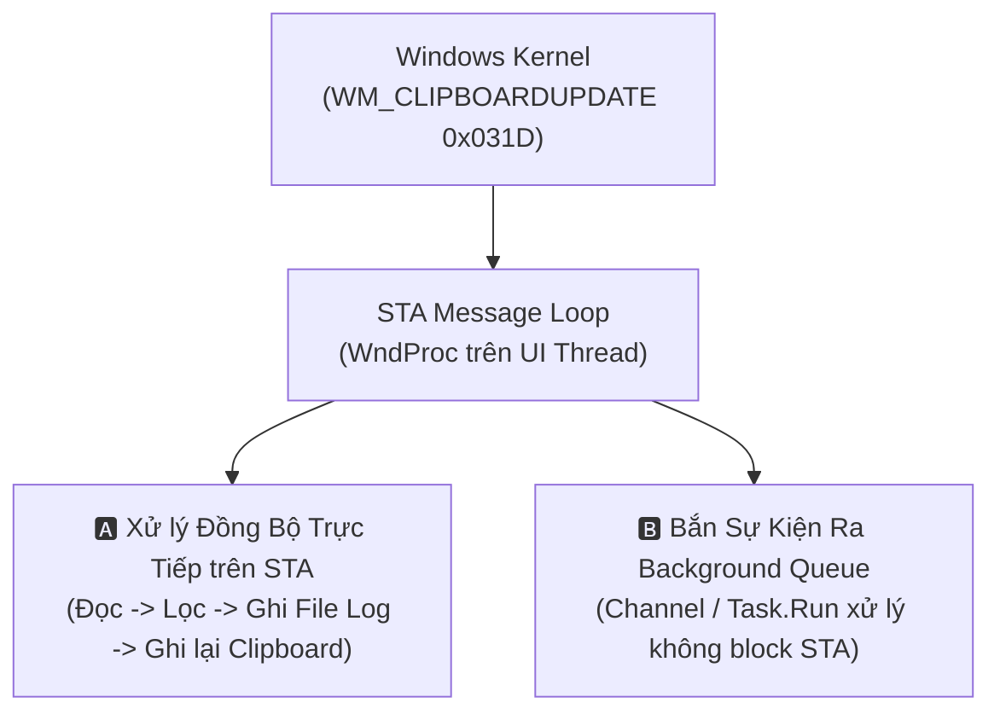

# 🧠 Playbook: Đánh Đổi Luồng Giao Diện STA vs Background Worker

> **Ngữ cảnh áp dụng:** Khi thiết kế luồng xử lý sự kiện OS (`WM_CLIPBOARDUPDATE`), ghi log, hoặc chạy các tác vụ lọc dữ liệu nặng.

---

## 1. Bản Chất Bài Toán

Hệ điều hành Windows yêu cầu cửa sổ ngầm (`HWND`) và API Clipboard phải chạy trên luồng có thuộc tính `[STAThread]` với một **Message Pump** liên tục (`Application.Run()`).

---

## 2. Bảng Ma Trận Đánh Đổi

| Tiêu Chí | 🅰️ Phương Án A: Xử Lý Đồng Bộ trên STA | 🅱️ Phương Án B: Phân Tách Background Channel |
| :--- | :--- | :--- |
| **Cơ chế** | Toàn bộ logic (đọc, lọc Regex, ghi log file, ghi clipboard) chạy tuần tự trong hàm `WndProc`. | Hàm `WndProc` chỉ nhận message, đọc chuỗi nhanh và đẩy vào `System.Threading.Channels.Channel<T>` để Background Worker xử lý. |
| **Ưu điểm (Gains)** | • Luồng điều khiển đơn giản, tuần tự, không lo lỗi tranh chấp luồng (Thread Concurrency / Race Condition). • Dễ debug từng bước. | • Luồng STA phản hồi ngay tức thì ($< 1\text{ms}$). • Ghi log ra ổ cứng chậm hay nghẽn I/O không bao giờ làm đơ icon System Tray hoặc treo Windows. |
| **Nhược điểm (Pains)** | • Nếu ghi file log bị nghẽn (Disk I/O lock) hoặc chuỗi quá dài $\rightarrow$ **Cửa sổ ẩn bị "Not Responding"**, bỏ lỡ sự kiện copy kế tiếp. | • Phức tạp hơn: Cần quản lý vòng đời của Background Worker, xử lý Synchronization khi ghi ngược lại Clipboard (vì Clipboard yêu cầu STA thread). |
| **Quyết định đề xuất** | **Chỉ áp dụng cho Pure Regex (< 5ms)** trong `3_Modules`. | **Bắt buộc áp dụng cho File Logging & Disk I/O** trong `2_PlatformAdapters/Logging`. |

---

## 3. Quy Tắc Phối Hợp Tối Ưu (Hybrid Approach)

1. **Lọc văn bản**: Chạy trực tiếp trên STA nếu độ dài chuỗi $< 100,000$ ký tự (thời gian xử lý $< 2\text{ms}$).
2. **Ghi Log ra đĩa**: Bắt buộc chuyển sang hàng đợi non-blocking (ví dụ: `Channel<string>` chạy background) để không chặn hàm `WndProc`.
