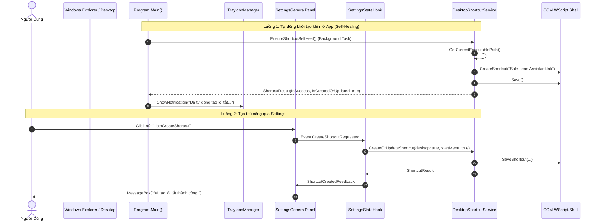

# Scope Document — Khảo Sát Vị Trí Tạo Shortcut & Lỗi Khởi Chạy Kèm Dev Terminal

**Feature**: `desktop-shortcut-management`  
**Date**: 2026-08-29  
**Status**: ✅ Analysis Complete — Context Ready (Read-Only)  
**Author**: Antigravity System Architect  

```yaml
must:
  - document all findings
  - use Vietnamese language in output
  - write output to Docs/context-to-work/desktop-shortcut-management/
  - trace all findings to specific files/lines
  - respect 3-layer architecture boundaries (0_Shared, 1_Backend, 2_Frontend)
must_not:
  - edit source code in scoping phase
  - create git branches or run destructive commands
  - violate clean 3-layer boundaries
confidence_threshold: 100
```

---

## §1: Problem Summary (Tóm Tắt Vấn Đề)

Hệ thống **AppForms** hỗ trợ tính năng tạo/cập nhật và tự phục hồi (Self-Healing) lối tắt ngoài màn hình Desktop và Start Menu (`Sale Lead Assistant.lnk`). Hiện tại có hai nơi chịu trách nhiệm kích hoạt tính năng này:
1. **Khởi chạy ngầm mặc định khi mở ứng dụng**: Cơ chế Self-Healing kiểm tra và tự động tạo/cập nhật shortcut trỏ vào đúng phiên bản `.exe` hiện tại.
2. **Thao tác thủ công của người dùng trong Màn hình Cài đặt (Settings)**: Nút bấm "Tạo / Làm mới lối tắt" và "Gỡ bỏ lối tắt".

### ⚠️ Triệu chứng lỗi (Issue Symptom)
Khi mở ứng dụng thông qua Shortcut được tạo trên Desktop, ngoài cửa sổ giao diện chính của ứng dụng WinForms, một cửa sổ dòng lệnh đen (Command Prompt / Dev Diagnostic Console) cũng tự động bật lên song song và in log realtime của Serilog.

---

## §2: Entry Point & Vị Trí Đảm Nhiệm Tạo Shortcut (Source Triangulation)

Hệ thống quản lý Shortcut tuân thủ nghiêm ngặt mô hình 3 tầng (Clean 3-Layer Architecture):

```
[0_Shared]
  └── Models/Shortcut/ShortcutResult.cs (DTO trả về kết quả)

[1_Backend]
  ├── Contracts/Interfaces/Adapter.IDesktopShortcutService.cs (Interface định nghĩa nghiệp vụ)
  ├── Adapters/Win32/Win32.DesktopShortcutService.cs (Thực thi tạo/sửa/xóa shortcut qua WScript.Shell COM)
  ├── Infrastructure/BackendServiceRegistration.cs (Đăng ký DI Singleton)
  └── Adapters/Diagnostics/Diagnostics.DebugConsole.cs & LoggingConfiguration.cs (Nguồn gốc console)

[2_Frontend]
  ├── Program.cs (Điểm gọi tạo shortcut tự động khi app startup)
  ├── Screens/Settings/Components/SettingsGeneralPanel.cs (Nút bấm UI)
  ├── Screens/Settings/Hooks/SettingsStateHook.cs (Orchestrator trung gian)
  └── Screens/Settings/SettingsScreen.cs (Kết nối UI và Hook)
```

### 1. Vị trí tạo Shortcut mặc định khi mở App (Startup Self-Healing)
- **Tập tin**: [`Program.cs:L41-L84`](Program.cs#L41-L84)
- **Phương thức**: `Program.TriggerBackgroundStartupTasks(IServiceProvider)`
- **Cơ chế**: Sau khi build DI Container và cấu hình App, gọi `Task.Run` chạy ngầm gọi `shortcutService.EnsureShortcutSelfHeal()`. Nếu tạo mới/cập nhật thành công sẽ đẩy notification lên khay hệ thống (`TrayIconManager`).

### 2. Vị trí tạo Shortcut thủ công trong Màn hình Cài Đặt (Settings)
- **Giao diện (UI Component)**: [`2_Frontend/Screens/Settings/Components/SettingsGeneralPanel.cs:L138-L165`](2_Frontend/Screens/Settings/Components/SettingsGeneralPanel.cs#L138-L165)
  - `_btnCreateShortcut`: Phát event `CreateShortcutRequested`
  - `_btnRemoveShortcut`: Phát event `RemoveShortcutRequested`
- **Tầng View (Screen)**: [`2_Frontend/Screens/Settings/SettingsScreen.cs:L95-L98`](2_Frontend/Screens/Settings/SettingsScreen.cs#L95-L98)
  - Đăng ký sự kiện từ `SettingsGeneralPanel` chuyển tiếp tới `SettingsStateHook`.
- **Tầng Điều Phối Trạng Thái (Hook)**: [`2_Frontend/Screens/Settings/Hooks/SettingsStateHook.cs:L194-L220`](2_Frontend/Screens/Settings/Hooks/SettingsStateHook.cs#L194-L220)
  - `CreateOrUpdateDesktopShortcut()`: Gọi `_shortcutService.CreateOrUpdateShortcut(desktop: true, startMenu: true)`
  - `RemoveDesktopShortcut()`: Gọi `_shortcutService.RemoveShortcut(desktop: true, startMenu: true)`

### 3. Tầng Xử Lý Nghiệp Vụ Cốt Lõi (Core Adapter Service)
- **Interface**: [`1_Backend/Contracts/Interfaces/Adapter.IDesktopShortcutService.cs:L1-L30`](1_Backend/Contracts/Interfaces/Adapter.IDesktopShortcutService.cs#L1-L30)
- **Implementation**: [`1_Backend/Adapters/Win32/Win32.DesktopShortcutService.cs:L11-L298`](1_Backend/Adapters/Win32/Win32.DesktopShortcutService.cs#L11-L298)
  - Sử dụng COM Object `WScript.Shell` (`dynamic shell = Activator.CreateInstance(Type.GetTypeFromProgID("WScript.Shell"))`).
  - Hàm `GetCurrentExecutablePath()` xác định đường dẫn file thực thi qua `Environment.ProcessPath` hoặc `AppDomain.CurrentDomain.BaseDirectory`.
  - Hàm `SaveShortcut()` cấu hình `TargetPath`, `WorkingDirectory`, `Description`, và `IconLocation` (`Assets/app_icon.ico`).

---

## §3: Scope Definition (Phạm Vi Phân Tích)

### 3.1 Problem Area
1. **Shortcut Target Resolution**: Cách thức `DesktopShortcutService` phân giải đường dẫn `.exe` mục tiêu (`GetCurrentExecutablePath`).
2. **Win32 Console Lifecycle**: Cơ chế khởi tạo Console (`AllocConsole`) trong `DebugConsole.Open()` và điều kiện kiểm tra môi trường trong `LoggingConfiguration.IsDevelopmentEnvironment()`.

### 3.2 Boundary (Ranh Giới)
- **Trong Scope**:
  - `DesktopShortcutService` (tính toán `TargetPath`, cách khởi chạy).
  - `DebugConsole` và `LoggingConfiguration` (điều kiện mở Win32 Console Window).
  - `Program.cs` (thứ tự startup và cờ môi trường).
- **Ngoài Scope**:
  - Không thay đổi nghiệp vụ trích xuất Lead hay Regex của `LeadConverterScreen`.
  - Không sửa đổi cấu trúc dữ liệu `0_Shared/Data/`.

---

## §4: Impact Analysis (Phân Tích Ảnh Hưởng)

### 4.1 Direct Impact (Ảnh Hưởng Trực Tiếp)
- [`1_Backend/Adapters/Diagnostics/Diagnostics.DebugConsole.cs`](1_Backend/Adapters/Diagnostics/Diagnostics.DebugConsole.cs):
  - Phương thức `Open()` được gọi vô điều kiện ở đầu `Program.cs:22` khi chạy bản build `DEBUG`.
  - Gọi `NativeMethods.AllocConsole()`, trực tiếp ép Windows gắn một cửa sổ Command Prompt vào tiến trình WinForms.
- [`1_Backend/Infrastructure/LoggingConfiguration.cs`](1_Backend/Infrastructure/LoggingConfiguration.cs):
  - Phương thức `IsDevelopmentEnvironment()`:
    ```csharp
    public static bool IsDevelopmentEnvironment()
    {
    #if DEBUG
        return true;
    #else
        ...
    ```
    Bất kỳ khi nào ứng dụng được build dưới cấu hình `Debug` (mặc định của Visual Studio / `dotnet build`), `IsDevelopmentEnvironment()` luôn trả về `true`.
- [`1_Backend/Adapters/Win32/Win32.DesktopShortcutService.cs`](1_Backend/Adapters/Win32/Win32.DesktopShortcutService.cs):
  - Khi shortcut được tạo ra trong quá trình phát triển (hoặc khi chạy `dotnet run`), `GetCurrentExecutablePath()` trỏ thẳng vào `bin/Debug/net6.0-windows/AppForms.exe`.
  - Khi mở Shortcut này, `AppForms.exe` (Debug) khởi chạy và thực thi `AllocConsole()`.

### 4.2 Indirect Impact (Ảnh Hưởng Gián Tiếp)
- **Trải nghiệm người dùng (UX)**: Người dùng cuối cảm thấy lạ lẫm hoặc lo sợ khi thấy cửa sổ console đen xuất hiện cùng app. Nếu người dùng vô tình tắt dấu `X` trên cửa sổ console đen đó, toàn bộ tiến trình ứng dụng WinForms sẽ bị tắt đột ngột (do `AllocConsole` gắn chung Process).
- **Logging Realtime**: Serilog Console Sink (`WriteTo.Console`) đang ghi log vào console này.

---

## §5: Call Chain (Chuỗi Gọi Phương Thức)

### 5.1 Luồng Khởi Tạo Shortcut (Self-Heal & Settings UI)



### 5.2 Luồng Khởi Chạy Shortcut Gây Ra Hiện Tượng Mở Terminal

```mermaid
sequenceDiagram
    autonumber
    actor User as Người Dùng
    participant Link as Shortcut (Sale Lead Assistant.lnk)
    participant Exe as bin/Debug/.../AppForms.exe
    participant Program as Program.Main()
    participant Dbg as DebugConsole.Open()
    participant Win32 as Win32 NativeMethods.AllocConsole()
    participant Serilog as LoggingConfiguration.Initialize()
    participant App as MainForm (WinForms)

    User->>Link: Double Click Shortcut
    Link->>Exe: Launch Executable TargetPath
    Exe->>Program: Main() Entry
    Program->>Dbg: DebugConsole.Open()
    Note over Dbg: Điều kiện #if DEBUG = true
    Dbg->>Win32: AllocConsole()
    Win32-->>User: ⚡ MỞ CỬA SỔ TERMINAL ĐEN (Diagnostic Console)
    Program->>Serilog: Initialize() -> In log ra Console Sink
    Program->>App: Application.Run(mainForm)
    App-->>User: Hiển thị giao diện WinForms
```

---

## §6: Data Flow & State Lifecycle

```
[Shortcut Creation Flow]
  Environment.ProcessPath / BaseDirectory
        │
        ▼
  DesktopShortcutService.GetCurrentExecutablePath()
        │
        ▼
  WScript.Shell COM Object ──> Thiết lập TargetPath, WorkingDir, Icon
        │
        ▼
  Tạo file .lnk tại:
    - %USERPROFILE%\Desktop\Sale Lead Assistant.lnk
    - %APPDATA%\Microsoft\Windows\Start Menu\Programs\Sale Lead Assistant.lnk

[Shortcut Execution Flow]
  Double click .lnk
        │
        ▼
  Chạy AppForms.exe
        │
        ├─► [Debug Mode] ──► DebugConsole.Open() ──► AllocConsole() [HIỆN CONSOLE ĐEN]
        └─► [Release Mode] ─► Không chạy AllocConsole (hoặc chỉ chạy khi có tham số --debug)
```

---

## §7: Affected Components (Chi Tiết Thành Phần)

| Layer | File / Symbol | Vai Trò |
| :--- | :--- | :--- |
| **0_Shared** | [`0_Shared/Models/Shortcut/ShortcutResult.cs`](0_Shared/Models/Shortcut/ShortcutResult.cs) | Record kết quả thao tác Shortcut (`IsSuccess`, `Message`, `IsCreatedOrUpdated`). |
| **1_Backend** | [`1_Backend/Contracts/Interfaces/Adapter.IDesktopShortcutService.cs`](1_Backend/Contracts/Interfaces/Adapter.IDesktopShortcutService.cs) | Contract định nghĩa các hàm quản lý shortcut. |
| **1_Backend** | [`1_Backend/Adapters/Win32/Win32.DesktopShortcutService.cs`](1_Backend/Adapters/Win32/Win32.DesktopShortcutService.cs) | Implementation COM `WScript.Shell` tạo và self-heal shortcut. |
| **1_Backend** | [`1_Backend/Adapters/Diagnostics/Diagnostics.DebugConsole.cs`](1_Backend/Adapters/Diagnostics/Diagnostics.DebugConsole.cs) | Chứa `AllocConsole()` mở cửa sổ console đen khi chạy. |
| **1_Backend** | [`1_Backend/Infrastructure/LoggingConfiguration.cs`](1_Backend/Infrastructure/LoggingConfiguration.cs) | Chứa `IsDevelopmentEnvironment()` và cấu hình Serilog Sinks. |
| **2_Frontend** | [`Program.cs`](Program.cs) | Điểm chạy `DebugConsole.Open()` và `TriggerBackgroundStartupTasks`. |
| **2_Frontend** | [`2_Frontend/Screens/Settings/Components/SettingsGeneralPanel.cs`](2_Frontend/Screens/Settings/Components/SettingsGeneralPanel.cs) | UI chứa các nút tạo/xóa Shortcut. |
| **2_Frontend** | [`2_Frontend/Screens/Settings/Hooks/SettingsStateHook.cs`](2_Frontend/Screens/Settings/Hooks/SettingsStateHook.cs) | StateHook điều phối thao tác Shortcut từ UI xuống Backend. |
| **2_Frontend** | [`2_Frontend/Screens/Settings/SettingsScreen.cs`](2_Frontend/Screens/Settings/SettingsScreen.cs) | Screen kết nối UI events với Hook. |

---

## §8: Evidence (Bằng Chứng Mã Nguồn)

<evidence>
  <file>1_Backend/Adapters/Diagnostics/Diagnostics.DebugConsole.cs</file>
  <line>11-22</line>
  <finding>
    DebugConsole.Open() có thuộc tính [Conditional("DEBUG")] và gọi NativeMethods.AllocConsole(). Khi build Debug, hàm này luôn cấp phát một cửa sổ Command Prompt thực sự cho tiến trình.
  </finding>
</evidence>

<evidence>
  <file>1_Backend/Infrastructure/LoggingConfiguration.cs</file>
  <line>20-23</line>
  <finding>
    IsDevelopmentEnvironment() trả về true ngay lập tức nếu #if DEBUG được bật.
  </finding>
</evidence>

<evidence>
  <file>1_Backend/Adapters/Win32/Win32.DesktopShortcutService.cs</file>
  <line>273-297</line>
  <finding>
    GetCurrentExecutablePath() lấy Environment.ProcessPath, trong môi trường dev sẽ là đường dẫn đến file debug binary `bin\Debug\net6.0-windows\AppForms.exe`.
  </finding>
</evidence>

<evidence>
  <file>Program.cs</file>
  <line>22</line>
  <finding>
    DebugConsole.Open() được gọi ngay dòng đầu tiên của hàm Main(), trước khi khởi tạo WinForms Application.
  </finding>
</evidence>

<evidence>
  <file>2_Frontend/Screens/Settings/Components/SettingsGeneralPanel.cs</file>
  <line>138-165</line>
  <finding>
    Các nút _btnCreateShortcut và _btnRemoveShortcut trên giao diện cài đặt kích hoạt sự kiện tạo và gỡ bỏ shortcut.
  </finding>
</evidence>

---

## §9: Confidence Assessment & Root Cause (Đánh Giá & Nguyên Nhân Cốt Lõi)

- **Overall Confidence**: **100%**
- **Nguyên nhân chính xác**:
  1. File `.csproj` đã cấu hình `<OutputType>WinExe</OutputType>`, bản thân ứng dụng WinForms thuần túy sẽ **không** mở console khi chạy.
  2. Tuy nhiên, tại [`Program.cs:22`](Program.cs#L22), hàm `DebugConsole.Open()` được gọi.
  3. Khi chạy dưới cấu hình `Debug` (hoặc tạo shortcut từ binary Debug), `DebugConsole.Open()` gọi API Win32 `NativeMethods.AllocConsole()`, khiến Windows cưỡng chế tạo một cửa sổ dòng lệnh đen chạy song song.
  4. Nếu ứng dụng được build ở cấu hình `Release` (hoặc nếu `AllocConsole()` chỉ được kích hoạt khi có đối số dòng lệnh tường minh ví dụ `--debug` hoặc biến môi trường), cửa sổ console này sẽ hoàn toàn biến mất khi khởi chạy bình thường từ Desktop Shortcut.

---

## §10: Đề Xuất Hướng Xử Lý Cho Phase Fix Tiếp Theo (Recommendations)

1. **Cơ chế kiểm soát mở Console (`DebugConsole.cs` & `Program.cs`)**:
   - Chỉ mở `AllocConsole()` khi người dùng/dev truyền tham số dòng lệnh tường minh (ví dụ: `AppForms.exe --debug` hoặc `AppForms.exe -v`) HOẶC khi có `Debugger.IsAttached`, thay vì tự động mở bất kỳ khi nào build `Debug`.
   - Hoặc phân biệt rõ ràng giữa môi trường chạy `dotnet run` (VS / IDE dev) và người dùng bấm trực tiếp vào `.exe` / Shortcut.
2. **Cập nhật `DesktopShortcutService.cs`**:
   - Đảm bảo shortcut được tạo không gắn cờ mở console (chạy sạch file `AppForms.exe`).

---

**Document Status**: Context Complete — No Code Changes Made (Tuân thủ nguyên tắc Context-Before-Fix).
