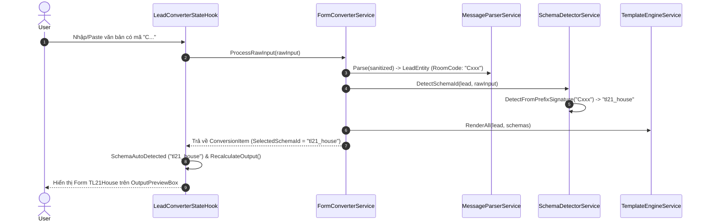

# Scope Document — Bổ sung Logic Phân Biệt Group (Tiền tố 'C' / 'c' -> TL21House)

**Date**: 2026-08-22  
**Status**: Ready  

---

## §1: Problem Summary

Hệ thống cần xác định chính xác các vị trí đảm nhiệm tính năng **Output Form** và bổ sung logic nghiệp vụ phân biệt group (nhận diện Schema):
- **Yêu cầu nghiệp vụ**: Với những input có mã phòng (hoặc mã định danh) bắt đầu bằng ký tự `"C"` hoặc `"c"` (ví dụ: `C101`, `c205`, `C-01`...), hệ thống sẽ tự động nhận diện và chuyển sang định dạng output **TL21** (`tl21_house` - TL21House).

---

## §2: Entry Point & Core Responsibilities

Vị trí đảm nhiệm tính năng **Output Form** và **Phân biệt Group** trong hệ thống gồm các module cốt lõi sau:

1. **Nhận diện Group / Schema tự động (Auto-Detection)**:
   - [SchemaDetectorService.cs](1_Backend/Services/SchemaDetectorService.cs#L88-L124) (`1_Backend/Services/SchemaDetectorService.cs`):
     - Hàm `DetectFromPrefixSignature(string roomCode)`: Đang xử lý các tiền tố như `mn`, `ts`, `nt`, `95`, `tl`. Đây là **nơi trực tiếp cần bổ sung logic check bắt đầu bằng "C" / "c"**.
     - Hàm `DetectSchemaWithDetails(LeadEntity lead, string? rawText)`: Điều phối 3 tầng nhận diện (RoomCode Prefix & Repo $\rightarrow$ TeamName $\rightarrow$ RawText Regex/Keyword).

2. **Trích xuất dữ liệu đầu vào (Input Parsing)**:
   - [MessageParserService.cs](1_Backend/Services/MessageParserService.cs#L139-L146) (`1_Backend/Services/MessageParserService.cs`):
     - Regex trích xuất mã phòng / mã nguồn / brand codes từ dòng text hoặc nhãn `Mã:` / `Mã phòng:`.
     - Cần đảm bảo regex nhận diện standalone brand code `brandCodeMatch` hoặc `roomMatch` bắt được các mã dạng `C\d+` nếu chưa có nhãn rõ ràng.

3. **Render Output Form & Template Engine**:
   - [TemplateEngineService.cs](1_Backend/Services/TemplateEngineService.cs#L8-L82) (`1_Backend/Services/TemplateEngineService.cs`):
     - Đảm nhiệm render nội dung theo `FormatSchema` (Header, Fields: Prefix + Value + Suffix, Footer).
   - [DefaultSchemas.cs](1_Backend/Contracts/Schemas/DefaultSchemas.cs#L31-L52) (`1_Backend/Contracts/Schemas/DefaultSchemas.cs`):
     - Định nghĩa cấu trúc schema của `tl21_house` (`TL21House`).

4. **Điều phối luồng xử lý và Hook State**:
   - [FormConverterService.cs](1_Backend/Services/FormConverterService.cs#L63-L107) (`1_Backend/Services/FormConverterService.cs`): Điều phối parsing, schema detection và template rendering.
   - [LeadConverterStateHook.cs](2_Frontend/Screens/LeadConverter/Hooks/LeadConverterStateHook.cs#L64-L100) (`2_Frontend/Screens/LeadConverter/Hooks/LeadConverterStateHook.cs`): Quản lý state cho màn hình chính, kích hoạt `SchemaAutoDetected` và cập nhật `FormattedOutput`.

---

## §3: Scope Definition

### 3.1 Problem Area
- `1_Backend/Services/SchemaDetectorService.cs` (Layer 1 Detection: Prefix Signatures).
- `1_Backend/Services/MessageParserService.cs` (Kiểm tra Regex bắt RoomCode với tiền tố C).
- `Tests/Backend/SchemaDetectorServiceTests.cs` (Unit tests cho logic nhận diện mới).

### 3.2 Boundary
- **Chỉ ảnh hưởng logic nhận diện (Detection & Parsing)**, không phá vỡ hợp đồng của `ISchemaDetector`, `IFormConverterService` hay `ITemplateEngine`.
- Không can thiệp sửa đổi WinForms UI layout.

---

## §4: Impact Analysis

### 4.1 Direct Impact
- `SchemaDetectorService.DetectFromPrefixSignature`: Thêm nhánh kiểm tra `cleaned.StartsWith("c", StringComparison.OrdinalIgnoreCase)` $\rightarrow$ trả về `"tl21_house"`.
- `MessageParserService`: Kiểm tra regex xem các mã như `C101`, `c 202`, `C-305` có được trích xuất vào `LeadEntity.RoomCode` một cách chuẩn xác hay không.

### 4.2 Indirect Impact
- `LeadConverterStateHook`: Tự động nhận diện `ActiveSchemaId = "tl21_house"` khi người dùng paste nội dung hoặc gõ mã phòng có tiền tố `C`/`c`.
- `OutputPreviewBox`: Hiển thị tức thì mẫu form `TL21House` thay vì báo cảnh báo hoặc hiển thị trống.

---

## §5: Call Chain



---

## §6: Data Flow

### 6.1 Input
- Chuỗi văn bản thô (Clipboard hoặc TextBox) chứa mã phòng bắt đầu bằng `C` / `c` (ví dụ: `MÃ PHÒNG: C383`, `Mã: c12`, `C402`).

### 6.2 Output
- `LeadEntity.RoomCode`: `"C383"`.
- `SchemaDetectionResult.MatchedSchemaId`: `"tl21_house"`.
- `FormattedOutput`:
```text
🏆TL21House🏆
☘️Địa chỉ : ...
☘️Giá : ...
☘️Sdt khách : ...
☘️Thời gian xem : ...
☘️CTV : Thiên Ngọc
☘️MÃ PHÒNG : C383
```

---

## §7: Affected Components

### 7.1 Files
- `1_Backend/Services/SchemaDetectorService.cs`
- `1_Backend/Services/MessageParserService.cs` (nếu cần tinh chỉnh regex nhận diện standalone prefix)
- `Tests/Backend/SchemaDetectorServiceTests.cs`

### 7.2 Classes & Methods
- `SchemaDetectorService.DetectFromPrefixSignature(string roomCode)`
- `MessageParserService.Parse(string rawText)`

---

## §8: Evidence

```xml
<evidence>
  <file>1_Backend/Services/SchemaDetectorService.cs</file>
  <line>88-123</line>
  <finding>Hàm DetectFromPrefixSignature hiện chỉ kiểm tra mn, ts, nt, 95, tl. Cần thêm điều kiện cleaned.StartsWith("c", StringComparison.OrdinalIgnoreCase) -> "tl21_house".</finding>
</evidence>
<evidence>
  <file>1_Backend/Services/TemplateEngineService.cs</file>
  <line>8-82</line>
  <finding>Nơi chịu trách nhiệm format dữ liệu sang mẫu output cuối cùng dựa vào SchemaId.</finding>
</evidence>
```

---

## §9: Confidence Assessment & Readiness

- **Overall Confidence**: 98%
- **Status**: NO CODE CHANGES MADE — Context ready for implementation phase.
