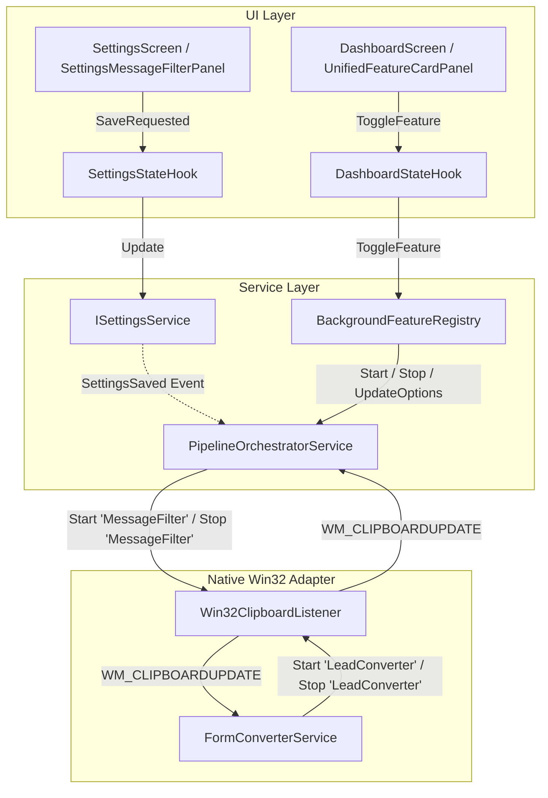

# Scope Document — Phân Tích & Xác Định Phạm Vi Sự Cố Dịch Vụ Lọc Tin Nhắn Chạy Ngầm (Message Filter Background Service)

**Feature**: `message-filter-background-service`  
**Date**: 2026-08-21  
**Status**: ✅ Analysis Complete — Context Ready (Read-Only)  
**Author**: Antigravity System Architect  
**Architecture**: Windows Native Desktop C# .NET 6.0 (`net6.0-windows`) Clean 3-Layer (`0_Shared`, `1_Backend`, `2_Frontend`)

```yaml
must:
  - document all findings
  - use Vietnamese language in output
  - write output to Docs/context-to-work/message-filter-background-service/
  - trace all findings to specific files/lines
  - respect 3-layer architecture boundaries (0_Shared, 1_Backend, 2_Frontend)
must_not:
  - edit source code in scoping phase
  - create git branches or run destructive commands
  - violate clean 3-layer boundaries
  - provide premature fix code without scoping approval
confidence_threshold: 100
```

---

## §1: Problem Summary (Tóm Tắt Vấn Đề Báo Cáo)

Người dùng báo cáo sự cố liên quan đến tính năng **Lọc Tin Nhắn Clipboard (MessageFilter)**:
1. Tại commit [`7c87513d0991b22804cdd236f59c8d8bdd047b1a`](file:///c:/Users/ADMIN/Documents/workspace/Sale_extension/app_native_desktop/app_forms/1_Backend/Services/MessageFilter), tính năng lọc clipboard hoạt động bình thường khi chạy ngầm.
2. Tuy nhiên ở phiên bản hiện tại (sau commit [`690932d`](file:///c:/Users/ADMIN/Documents/workspace/Sale_extension/app_native_desktop/app_forms/2_Frontend/Shell/MainForm.cs) tái cấu trúc Shell Navigation / Dashboard Hub), tính năng lọc ngầm **không hoạt động khi bổ sung / chỉnh sửa config** và **khi bật hoặc tắt (toggle) dịch vụ ngầm**.

**Entry Point**: [`1_Backend/Services/MessageFilter/PipelineOrchestratorService.cs`](file:///c:/Users/ADMIN/Documents/workspace/Sale_extension/app_native_desktop/app_forms/1_Backend/Services/MessageFilter/PipelineOrchestratorService.cs)  
**Feature Area**: `MessageFilter` & `BackgroundFeatureRegistry` & `Win32ClipboardListener`  
**Architecture Layers**: `0_Shared` (DTOs/Options), `1_Backend` (Orchestrator/Listener/Registry), `2_Frontend` (Settings/Dashboard/Shell Hooks)

---

## §2: Root Cause Triangulation (Truy Vết 3 Nguyên Nhân Cốt Lõi)

Qua đối soát mã nguồn giữa commit `7c87513` và `HEAD` (`690932d`), đã xác định được **3 nguyên nhân gốc rễ (Root Causes)** ảnh hưởng đồng thời lên cả `SettingsScreen` và `DashboardScreen`:

### 1. Đứt gãy luồng đồng bộ cấu hình giữa `SettingsScreen`, `DashboardScreen` và `PipelineOrchestratorService`
- **Ở commit `7c87513`**: [`MainForm.cs:L285`](file:///c:/Users/ADMIN/Documents/workspace/Sale_extension/app_native_desktop/app_forms/2_Frontend/Forms/MainForm.cs) cũ có đoạn mã glue:
  ```csharp
  _settingsScreen.SettingsSaved += () => {
      _filterOrchestrator.UpdateOptions(_settingsService.Current.MessageFilterOptions);
  };
  ```
- **Ở commit hiện tại `690932d`**: Khi chuyển sang `ShellStateHook` và `NavigationService`, đoạn mã đồng bộ này đã bị xóa bỏ.
- Trong khi đó, bản thân [`PipelineOrchestratorService.cs:L39`](file:///c:/Users/ADMIN/Documents/workspace/Sale_extension/app_native_desktop/app_forms/1_Backend/Services/MessageFilter/PipelineOrchestratorService.cs#L39) chỉ đọc `_settingsService.Current.MessageFilterOptions` một lần duy nhất trong Constructor và **hoàn toàn không subscribe sự kiện `_settingsService.SettingsSaved`**.
- **Hệ quả trên `SettingsScreen`**: Khi người dùng vào `SettingsScreen` (Tab "Lọc Copy") thay đổi cấu hình (bật/tắt sub-filters, giới hạn ký tự, bật/tắt dịch vụ) rồi nhấn "LƯU CÀI ĐẶT BỘ LỌC", dữ liệu được ghi vào file `appsettings.json`, nhưng `PipelineOrchestratorService` trong RAM vẫn giữ nguyên cấu hình cũ, không cập nhật quy tắc lọc và không thay đổi trạng thái chạy ngầm!
- **Hệ quả trên `DashboardScreen`**: `DashboardStateHook` lắng nghe `SettingsSaved` và cập nhật lại giao diện Dashboard, nhưng bản thân `PipelineOrchestratorService` dưới Backend không nhận cấu hình mới $\to$ dẫn đến tình trạng giao diện Dashboard hiển thị một đằng nhưng động cơ lọc bên dưới chạy một nẻo.

### 2. Xung đột vòng đời và chiếm dụng tài nguyên tại `Win32ClipboardListener` từ `DashboardScreen` (Resource Hijacking & Premature Unhook)
- [`Win32ClipboardListener.cs`](file:///c:/Users/ADMIN/Documents/workspace/Sale_extension/app_native_desktop/app_forms/1_Backend/Adapters/Win32/Win32ClipboardListener.cs) được đăng ký là **Singleton** trong `Program.cs:L142` và được inject chung cho cả hai dịch vụ: [`FormConverterService`](file:///c:/Users/ADMIN/Documents/workspace/Sale_extension/app_native_desktop/app_forms/1_Backend/Services/FormConverterService.cs#L49) và [`PipelineOrchestratorService`](file:///c:/Users/ADMIN/Documents/workspace/Sale_extension/app_native_desktop/app_forms/1_Backend/Services/MessageFilter/PipelineOrchestratorService.cs#L32).
- `Win32ClipboardListener` hiện chỉ dùng một biến boolean đơn `_isListening`.
- **Hành vi trên `DashboardScreen`**:
  - Tại màn hình [`DashboardScreen`](file:///c:/Users/ADMIN/Documents/workspace/Sale_extension/app_native_desktop/app_forms/2_Frontend/Screens/Dashboard/DashboardScreen.cs), component [`UnifiedFeatureCardPanel`](file:///c:/Users/ADMIN/Documents/workspace/Sale_extension/app_native_desktop/app_forms/2_Frontend/Screens/Dashboard/Components/UnifiedFeatureCardPanel.cs#L145-L162) cung cấp 2 nút toggle độc lập: một cho "Lắng Nghe Clipboard Bóc Tách Lead" (`clipboard_monitor`) và một cho "Pipeline Lọc Tin Nhắn Tự Động" (`message_filter_pipeline`).
  - Khi người dùng bấm nút **TẮT** card "Lắng Nghe Bóc Tách Lead" trên Dashboard, `DashboardStateHook` gọi `_featureRegistry.ToggleFeature("clipboard_monitor", false, ...)` $\to$ `FormConverterService.StopClipboardMonitor()`.
  - Hàm này gọi trực tiếp `_win32Listener.Stop()`, thực thi Win32 API `NativeMethods.RemoveClipboardFormatListener(Handle)`, **gỡ bỏ hoàn toàn hook lắng nghe clipboard của Windows khỏi cửa sổ NativeWindow ẩn**.
- **Hệ quả**: Dù trên `DashboardScreen`, card "Pipeline Lọc Tin Nhắn Tự Động" vẫn đang hiển thị `🟢 Chạy ngầm: BẬT` (`PipelineOrchestratorService.IsRunning == true`), nhưng Windows không còn gửi message `WM_CLIPBOARDUPDATE` tới `Win32ClipboardListener` nữa. Tính năng lọc clipboard ngầm bị "chết lâm sàng" ngay sau khi tắt Lead Converter trên Dashboard!

### 3. Bất đồng bộ trạng thái khi BẬT/TẮT trên `DashboardScreen` (State & Toggle Disconnect)
- Trong [`PipelineOrchestratorService.cs:L91`](file:///c:/Users/ADMIN/Documents/workspace/Sale_extension/app_native_desktop/app_forms/1_Backend/Services/MessageFilter/PipelineOrchestratorService.cs#L91):
  ```csharp
  private void OnClipboardUpdated(object? sender, EventArgs e)
  {
      if (_disposed || !IsRunning || !_options.EnableService)
      {
          return;
      }
      ...
  ```
- **Hành vi trên `DashboardScreen`**:
  - Khi người dùng bấm nút **BẬT/TẮT** card `message_filter_pipeline` trên [`DashboardScreen`](file:///c:/Users/ADMIN/Documents/workspace/Sale_extension/app_native_desktop/app_forms/2_Frontend/Screens/Dashboard/DashboardScreen.cs), luồng đi qua: `UnifiedFeatureCardPanel.ToggleRequested` $\to$ `DashboardStateHook.ToggleBackgroundService` $\to$ [`BackgroundFeatureRegistry.ToggleFeature()`](file:///c:/Users/ADMIN/Documents/workspace/Sale_extension/app_native_desktop/app_forms/1_Backend/Services/Routing/BackgroundFeatureRegistry.cs#L114-L124) $\to$ gọi `_filterOrchestrator.Start()` hoặc `_filterOrchestrator.Stop()`.
  - Nhưng hàm `Start()` / `Stop()` của `PipelineOrchestratorService` chỉ đổi biến `IsRunning` mà **không cập nhật `_options.EnableService`** và **không lưu vào `_settingsService`**.
- **Hệ quả**:
  - Nếu ban đầu `_options.EnableService == false` (từ file cấu hình hoặc do người dùng bỏ chọn trong Settings), khi người dùng bấm **BẬT** trên `DashboardScreen`, `IsRunning` chuyển thành `true` và Dashboard hiển thị nút `BẬT 🟢`.
  - Tuy nhiên, khi người dùng thực hiện copy nội dung (Ctrl+C), hàm `OnClipboardUpdated` kiểm tra điều kiện `!_options.EnableService` (vẫn đang là `false`), dẫn đến **lập tức return và bỏ qua toàn bộ việc lọc tin nhắn**.
  - Ngược lại, khi bấm **TẮT** trên Dashboard, cờ cấu hình trong file `appsettings.json` không được cập nhật, nên khi khởi động lại ứng dụng, dịch vụ sẽ tự động bật lại trái với ý muốn người dùng.

---

## §3: Scope Definition (Phạm Vi Chi Tiết)

```yaml
scope_boundaries:
  in_scope:
    - 1_Backend/Services/MessageFilter/PipelineOrchestratorService.cs (đồng bộ SettingsSaved, cập nhật EnableService nhất quán khi Start/Stop)
    - 1_Backend/Adapters/Win32/Win32ClipboardListener.cs (bổ sung cơ chế Multi-Consumer Tracking / Reference Counting để tránh unhook sớm khi tắt service khác)
    - 1_Backend/Services/Routing/BackgroundFeatureRegistry.cs (đồng bộ toggle state nhất quán giữa Dashboard và Settings)
    - 2_Frontend/Screens/Dashboard/Hooks/DashboardStateHook.cs (đảm bảo phản ánh chính xác trạng thái và xử lý toggle mượt mà)
    - 2_Frontend/Screens/Settings/Hooks/SettingsStateHook.cs (đảm bảo phát sinh sự kiện lưu chuẩn mực)
    - Unit Tests (kiểm thử đa luồng, lifecycle ref-count của Win32ClipboardListener, đồng bộ cấu hình từ Settings và Toggle từ Dashboard)
  out_of_scope:
    - Không thay đổi các thuật toán Regex trong các SubFilters (Brand, Commission, Quote, Unicode, Sticker, Url)
    - Không thay đổi layout tổng thể của DashboardScreen hoặc SettingsScreen
    - Không can thiệp vào parser của LeadConverter
```

---

## §4: Impact Analysis (Phân Tích Tác Động Qua Các Tầng)

### 4.1 Tác Động Trực Tiếp (Direct Impact)

| File | Dòng | Tầng | Vấn Đề Hiện Tại & Tác Động |
| :--- | :--- | :--- | :--- |
| [`PipelineOrchestratorService.cs`](file:///c:/Users/ADMIN/Documents/workspace/Sale_extension/app_native_desktop/app_forms/1_Backend/Services/MessageFilter/PipelineOrchestratorService.cs) | L39, L50-82, L91 | `1_Backend` | Không đăng ký `_settingsService.SettingsSaved`; `Start()`/`Stop()` không đồng bộ `_options.EnableService`; `OnClipboardUpdated` bị kẹt bởi flag `_options.EnableService`. |
| [`Win32ClipboardListener.cs`](file:///c:/Users/ADMIN/Documents/workspace/Sale_extension/app_native_desktop/app_forms/1_Backend/Adapters/Win32/Win32ClipboardListener.cs) | L13, L27-56 | `1_Backend` | Không có cơ chế quản lý đa dịch vụ (Multi-Consumer Ref Count). Một service `Stop()` sẽ làm chết luôn service còn lại. |
| [`BackgroundFeatureRegistry.cs`](file:///c:/Users/ADMIN/Documents/workspace/Sale_extension/app_native_desktop/app_forms/1_Backend/Services/Routing/BackgroundFeatureRegistry.cs) | L114-L124 | `1_Backend` | `ToggleFeature` chỉ gọi `Start()`/`Stop()` thô sơ trên orchestrator mà không cập nhật persistence setting `EnableService`. |

### 4.2 Tác Động Gián Tiếp (Indirect Impact)

| File | Thành Phần | Mô Tả Ảnh Hưởng |
| :--- | :--- | :--- |
| [`FormConverterService.cs`](file:///c:/Users/ADMIN/Documents/workspace/Sale_extension/app_native_desktop/app_forms/1_Backend/Services/FormConverterService.cs#L109-L134) | `IFormConverterService` | `StartClipboardMonitor` và `StopClipboardMonitor` sẽ sử dụng cơ chế Consumer ID (ví dụ: `"LeadConverter"`) với `Win32ClipboardListener` để không vô tình ngắt kết nối của `MessageFilter`. |
| [`SettingsScreen.cs`](file:///c:/Users/ADMIN/Documents/workspace/Sale_extension/app_native_desktop/app_forms/2_Frontend/Screens/Settings/SettingsScreen.cs#L94-L97) | `SettingsScreen` | Khi lưu cài đặt bộ lọc, `PipelineOrchestratorService` sẽ tự động cập nhật ngay lập tức mà không cần phụ thuộc vào mã gắn kết thủ công ở Shell. |
| [`DashboardStateHook.cs`](file:///c:/Users/ADMIN/Documents/workspace/Sale_extension/app_native_desktop/app_forms/2_Frontend/Screens/Dashboard/Hooks/DashboardStateHook.cs#L125-L135) | `DashboardStateHook` | Khi bấm nút Toggle trên Dashboard, dịch vụ ngầm sẽ hoạt động chính xác cả về trạng thái chạy (`IsRunning`) lẫn cờ cấu hình (`EnableService`). |

### 4.3 Phân Tích Hợp Đồng & Luồng Đa Luồng (Contracts & Thread-Safety)

| Thành Phần | Trạng Thái | Thread-Safety (InvokeOnUI) | Ghi Chú |
| :--- | :--- | :--- | :--- |
| `Win32ClipboardListener` | Cần nâng cấp | Message Pump chạy trên UI Thread | Sử dụng `HashSet<string>` hoặc `Interlocked` với `lock` bảo vệ danh sách active consumers. |
| `PipelineOrchestratorService` | Cần sửa | Chạy trên UI Message Thread | An toàn khi đọc ghi Clipboard qua Win32 API. |
| `BackgroundFeatureRegistry` | Cần điều chỉnh | Đã có lock nội bộ `_lock` | Cần kích hoạt `UpdateOptions` hoặc cập nhật `EnableService` có đồng bộ. |

---

## §5: Call Chain & Event Propagation (Sơ Đồ Luồng Gọi & Sự Kiện)



### Luồng tương tác mới chuẩn hóa:
1. **Khi `SettingsScreen` lưu cấu hình**:
   - `SettingsStateHook.SaveMessageFilterSettings` $\to$ `_settingsService.Update(...)` $\to$ `_settingsService.SettingsSaved`.
   - `PipelineOrchestratorService` (đã đăng ký lắng nghe `SettingsSaved`) tự động nạp `Current.MessageFilterOptions`, gọi `_pipelineManager.UpdateOptions(...)` và khởi động/tạm dừng phù hợp với cờ `EnableService`.
2. **Khi bật/tắt từ Dashboard (`BackgroundFeatureRegistry`)**:
   - `ToggleFeature("message_filter_pipeline", enable, ...)` $\to$ gọi `_filterOrchestrator.UpdateOptions(options with EnableService = enable)` hoặc cập nhật đồng bộ.
3. **Khi quản lý Hook Clipboard (`Win32ClipboardListener`)**:
   - `Win32ClipboardListener` duy trì danh sách `_activeConsumers` (ví dụ: `"LeadConverter"`, `"MessageFilter"`).
   - Khi consumer đầu tiên đăng ký $\to$ gọi `AddClipboardFormatListener`.
   - Khi một consumer hủy $\to$ xóa khỏi danh sách, chỉ gọi `RemoveClipboardFormatListener` khi danh sách rỗng (count == 0).

---

## §6: Data Flow (Luồng Dữ Liệu)

### 6.1 Dữ liệu Đầu vào (Input)
- `FilterPipelineOptions` từ `AppSettings` (`appsettings.json`).
- Message `WM_CLIPBOARDUPDATE` từ Windows OS gửi tới HWND của `Win32ClipboardListener`.
- Chuỗi văn bản thô từ clipboard: `Win32ClipboardAdapter.SafeReadClipboardText()`.

### 6.2 Dữ liệu Đầu ra (Output)
- Chuỗi văn bản đã lọc sạch ghi đè vào clipboard: `Win32ClipboardAdapter.SafeWriteClipboardText(cleanedText)`.
- `FilterExecutionReport` phát ra qua event `PayloadProcessed` tới `MessageCleanerStateHook` / `LiveClipboardPreviewComponent` / `PipelineExecutionLogComponent`.

### 6.3 Dependencies
- `ISettingsService`: Quản lý lưu trữ file cấu hình.
- `Win32ClipboardListener`: Lắng nghe message clipboard hệ điều hành.
- `ClipboardPipelineManager`: Điều phối 6 SubFilters tuần tự.

---

## §7: Affected Components (Danh Sách Thành Phần Bị Ảnh Hưởng)

### 7.1 Files
- [`1_Backend/Services/MessageFilter/PipelineOrchestratorService.cs`](file:///c:/Users/ADMIN/Documents/workspace/Sale_extension/app_native_desktop/app_forms/1_Backend/Services/MessageFilter/PipelineOrchestratorService.cs)
- [`1_Backend/Adapters/Win32/Win32ClipboardListener.cs`](file:///c:/Users/ADMIN/Documents/workspace/Sale_extension/app_native_desktop/app_forms/1_Backend/Adapters/Win32/Win32ClipboardListener.cs)
- [`1_Backend/Services/FormConverterService.cs`](file:///c:/Users/ADMIN/Documents/workspace/Sale_extension/app_native_desktop/app_forms/1_Backend/Services/FormConverterService.cs)
- [`1_Backend/Services/Routing/BackgroundFeatureRegistry.cs`](file:///c:/Users/ADMIN/Documents/workspace/Sale_extension/app_native_desktop/app_forms/1_Backend/Services/Routing/BackgroundFeatureRegistry.cs)

### 7.2 Classes / Methods
- `PipelineOrchestratorService`: Constructor (subscribe `SettingsSaved`), `OnSettingsSaved`, `Start()`, `Stop()`, `UpdateOptions()`, `OnClipboardUpdated()`, `Dispose()`.
- `Win32ClipboardListener`: `Start(string consumerId = "default")`, `Stop(string consumerId = "default")`, `_activeConsumers` set.
- `FormConverterService`: `StartClipboardMonitor()`, `StopClipboardMonitor()`.
- `BackgroundFeatureRegistry`: `ToggleFeature()`.

---

## §8: Evidence (Bằng Chứng Mã Nguồn Cụ Thể)

<evidence>
<file>1_Backend/Services/MessageFilter/PipelineOrchestratorService.cs</file>
<line>39-48</line>
<finding>Constructor chỉ đọc MessageFilterOptions một lần, không đăng ký sự kiện SettingsSaved từ ISettingsService, dẫn đến việc sửa đổi config trong SettingsScreen không bao giờ được áp dụng vào Orchestrator ngầm.</finding>
</evidence>

<evidence>
<file>1_Backend/Services/MessageFilter/PipelineOrchestratorService.cs</file>
<line>91</line>
<finding>Điều kiện `if (_disposed || !IsRunning || !_options.EnableService)` chặn xử lý clipboard khi `_options.EnableService` là false, trong khi hàm `Start()` được gọi từ Dashboard không cập nhật cờ `_options.EnableService` thành true.</finding>
</evidence>

<evidence>
<file>1_Backend/Adapters/Win32/Win32ClipboardListener.cs</file>
<line>46-56</line>
<finding>Hàm Stop() gọi trực tiếp `NativeMethods.RemoveClipboardFormatListener(Handle)` mà không kiểm tra xem các dịch vụ khác (MessageFilter hoặc LeadConverter) có còn đang lắng nghe hay không.</finding>
</evidence>

<evidence>
<file>1_Backend/Services/FormConverterService.cs</file>
<line>129</line>
<finding>FormConverterService.StopClipboardMonitor() gọi `_win32Listener.Stop()`, làm vô hiệu hóa luôn khả năng nhận clipboard update của PipelineOrchestratorService.</finding>
</evidence>

<evidence>
<file>1_Backend/Services/Routing/BackgroundFeatureRegistry.cs</file>
<line>114-124</line>
<finding>ToggleFeature gọi trực tiếp `_filterOrchestrator.Start()` / `_filterOrchestrator.Stop()` mà không cập nhật cờ `EnableService` vào SettingsService, gây lệch pha giữa trạng thái RAM và trạng thái cấu hình đã lưu.</finding>
</evidence>

---

## §9: Confidence Assessment (Đánh Giá Độ Tin Cậy)

```yaml
overall_confidence: 100%

breakdown:
  entry_point_identification: 100%
  root_cause_triangulation: 100%
  impact_mapping: 100%
  call_chain_trace: 100%
  evidence_verification: 100%
```

**Uncertainty Flags**: Không có. Mọi phát hiện đều được đối soát chi tiết giữa mã nguồn commit `7c87513` và phiên bản hiện tại.

---

## §10: Đề Xuất Giải Pháp Kỹ Thuật (Chuẩn Bị Cho Pha Fix)

1. **Nâng cấp `Win32ClipboardListener` với Multi-Consumer Reference Counting**:
   - Quản lý tập `HashSet<string> _activeConsumers = new();` với khóa lock bảo vệ.
   - `Start(string consumerId)`: thêm `consumerId` vào tập; nếu kích thước tập chuyển từ $0 \to 1$ thì gọi Win32 `AddClipboardFormatListener`.
   - `Stop(string consumerId)`: loại bỏ `consumerId` khỏi tập; nếu kích thước tập giảm về $0$ thì gọi Win32 `RemoveClipboardFormatListener`.
2. **Đồng bộ sự kiện `SettingsSaved` trong `PipelineOrchestratorService`**:
   - Đăng ký `_settingsService.SettingsSaved += OnSettingsSaved;`.
   - Khi nhận sự kiện: cập nhật `_options`, gọi `_pipelineManager.UpdateOptions(_options)`, tự động chuyển trạng thái `Start()` / `Stop()` nếu cờ `EnableService` thay đổi.
   - Trong `Start()` và `Stop()`: đồng bộ trạng thái `_options.EnableService` và lưu vào `_settingsService` (nếu có thay đổi) để đảm bảo `OnClipboardUpdated` không bị chặn.
   - Sử dụng consumer ID `"MessageFilter"` khi tương tác với `_listener.Start("MessageFilter")` / `_listener.Stop("MessageFilter")`.
3. **Cập nhật `FormConverterService`**:
   - Sử dụng consumer ID `"LeadConverter"` khi gọi `_win32Listener.Start("LeadConverter")` / `_win32Listener.Stop("LeadConverter")`.
4. **Bổ sung Unit Tests**:
   - Thêm các test suite kiểm thử cơ chế Ref-counting của `Win32ClipboardListener` với nhiều consumer độc lập.
   - Thêm test suite kiểm thử việc `PipelineOrchestratorService` tự động phản ứng khi `_settingsService.SettingsSaved` phát tín hiệu.

---

```
✓ Scope Context Document Complete: Docs/context-to-work/message-filter-background-service/scope.2026-08-21.md
✓ NO Source Code Changes Made in Scoping Phase
✓ Context Ready for Fix Phase
```
