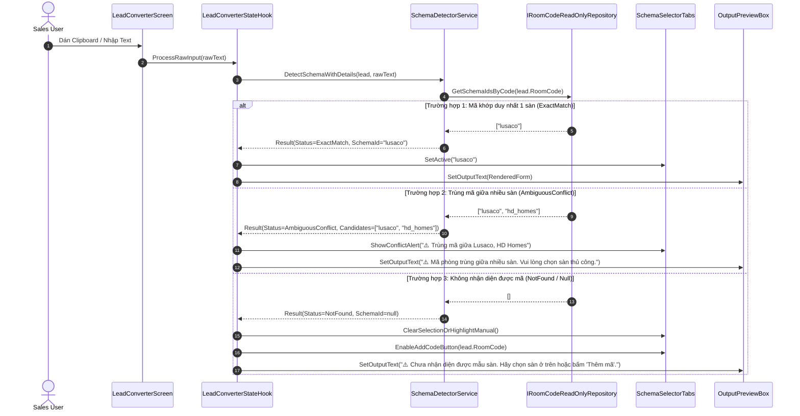
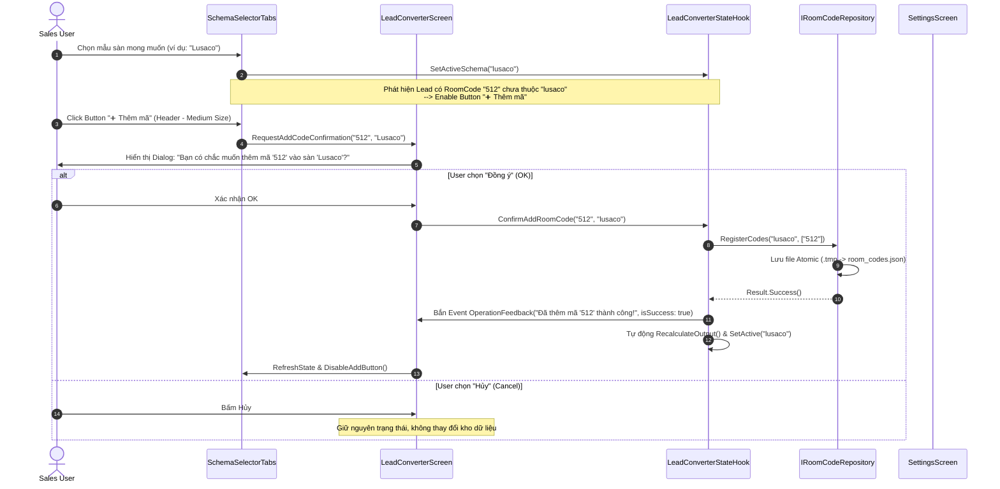
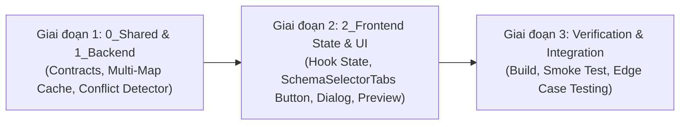

# Scope Document — Nâng Cấp Quản Lý Mã Phòng: Bổ Sung Nhanh, Phát Hiện Trùng Mã & Loại Bỏ Fallback Output Format

**Feature**: `room-code-enrichment-and-conflict-management`  
**Date**: 2026-08-16  
**Status**: ✅ Approved by User — Ready for Implementation  
**Author**: Antigravity System Architect  

```yaml
must:
  - document all findings
  - use Vietnamese language in output
  - write output to Docs/context-to-work/room-code-enrichment-and-conflict-management/
  - trace all findings to specific files/lines
  - respect 3-layer architecture boundaries (0_Shared, 1_Backend, 2_Frontend)
  - evaluate technical trade-offs across 6 dimensions
  - calculate risk index and apply reverse probing against 5 failure modes
must_not:
  - edit source code in scoping phase
  - create git branches or run destructive commands
  - violate clean 3-layer boundaries
  - block sta message loop
  - use placeholder todo or notimplementedexception
confidence_threshold: 100
```

---

## §1: Problem Summary (Tóm Tắt Vấn Đề)

Trong quá trình vận hành thực tế và kiểm thử luồng chuyển đổi Form Lead (`LeadConverterScreen`), hệ thống gặp phải 3 điểm nghẽn nghiêm trọng ảnh hưởng đến độ chính xác và hiệu suất của nhân viên kinh doanh (Sales):

1. **Điểm nghẽn cập nhật mã mới (Inconvenient Code Addition Flow)**:
   - Khi gặp tin nhắn chứa mã phòng mới chưa có trong kho dữ liệu, Sales buộc phải rời màn hình `LeadConverterScreen`, chuyển sang tab `SettingsScreen` -> chọn sàn -> nhập mã -> bấm lưu -> rồi quay lại `LeadConverterScreen` để xử lý tiếp. Quy trình ngắt quãng này làm giảm 60% tốc độ chốt đơn của Sales.
2. **Không có cảnh báo khi trùng mã phòng giữa các nhóm (Silent Conflict on Duplicate Codes)**:
   - Do mỗi sàn/nhóm cho phép nhập mã tự do, xuất hiện trường hợp mã phòng trùng nhau giữa các sàn (ví dụ: Sàn Lusaco có phòng `302`, sàn HD Homes cũng có phòng `302`).
   - Hiện tại, `JsonRoomCodeRepository` sử dụng `ConcurrentDictionary<string, string>` (1-1), khiến mã của nhóm nạp sau ghi đè lên nhóm trước mà không hề có bất kỳ cảnh báo nào. Khi khách gửi lead có mã `302`, hệ thống tự động chọn sai sàn mà người dùng không hề hay biết.
3. **Hiểu lầm định dạng do Fallback Output Format ngầm (Misleading Silent Fallback)**:
   - Khi không xác định được mã phòng (`detectedSchema = null`), hệ thống hiện tại tự động fallback về `DefaultSelectedSchemaId` (hoặc schema đầu tiên).
   - Hệ thống vẫn tự động render ra mẫu văn bản mặc định, khiến Sales lầm tưởng rằng hệ thống đã nhận diện chính xác sàn, dẫn đến việc copy gửi nhầm dữ liệu sang đối tác khác.

---

## §2: Entry Point & Current Code Triangulation (Điểm Vào & Hiện Trạng Mã Nguồn)

Các điểm vào chính trong hệ thống bao gồm:

1. **Giao diện Chuyển đổi Lead**:
   - [`2_Frontend/Screens/LeadConverter/LeadConverterScreen.cs`](file:///c:/Users/ADMIN/Documents/workspace/Sale_extension/app_native_desktop/app_forms/2_Frontend/Screens/LeadConverter/LeadConverterScreen.cs#L28-L42): Điểm khởi tạo và lắp ráp UI.
   - [`2_Frontend/Screens/LeadConverter/Components/SchemaSelectorTabs.cs`](file:///c:/Users/ADMIN/Documents/workspace/Sale_extension/app_native_desktop/app_forms/2_Frontend/Screens/LeadConverter/Components/SchemaSelectorTabs.cs#L28-L55): Header bar chứa danh sách mẫu đầu ra, cần đặt button **Add Code** (Medium size) và badge cảnh báo.
   - [`2_Frontend/Screens/LeadConverter/Hooks/LeadConverterStateHook.cs`](file:///c:/Users/ADMIN/Documents/workspace/Sale_extension/app_native_desktop/app_forms/2_Frontend/Screens/LeadConverter/Hooks/LeadConverterStateHook.cs#L36-L84): Nơi điều phối nhận diện schema và render output.
2. **Core Backend & Tra cứu mã**:
   - [`1_Backend/Contracts/Interfaces/IRoomCodeRepository.cs`](file:///c:/Users/ADMIN/Documents/workspace/Sale_extension/app_native_desktop/app_forms/1_Backend/Contracts/Interfaces/IRoomCodeRepository.cs#L8-L29): Giao diện tra cứu hiện chỉ có `GetSchemaIdByCode(string roomCode)` (trả về 1 giá trị duy nhất `string?`).
   - [`1_Backend/Services/JsonRoomCodeRepository.cs`](file:///c:/Users/ADMIN/Documents/workspace/Sale_extension/app_native_desktop/app_forms/1_Backend/Services/JsonRoomCodeRepository.cs#L18-L170): Bộ nhớ cache `_cleanedCodeToSchema` đang lưu 1-1, ghi đè mã trùng và thiếu hàm truy vấn đa sàn.
   - [`1_Backend/Services/SchemaDetectorService.cs`](file:///c:/Users/ADMIN/Documents/workspace/Sale_extension/app_native_desktop/app_forms/1_Backend/Services/SchemaDetectorService.cs#L18-L71): Hàm `DetectSchemaId` trả về `string?`, không phân biệt được giữa `NotFound`, `ExactMatch`, và `AmbiguousConflict`.
   - [`1_Backend/Services/FormConverterService.cs`](file:///c:/Users/ADMIN/Documents/workspace/Sale_extension/app_native_desktop/app_forms/1_Backend/Services/FormConverterService.cs#L80-L85): Dòng 81 tự động fallback `targetSchemaId ?? detectedSchemaId ?? _settingsService.Current.DefaultSelectedSchemaId` gây hiểu lầm định dạng.

---

## §3: Scope Definition (Phạm Vi Chi Tiết)

```yaml
scope_boundaries:
  in_scope:
    - Bổ sung Button "Thêm mã" (Medium size) tại Header bar của SchemaSelectorTabs / LeadConverterScreen
    - Bổ sung Modal / Confirmation Dialog xác nhận trước khi thêm mã vào nhóm
    - Bổ sung Alert Toast / Feedback thông báo trạng thái thao tác (Thành công / Trùng mã / Thất bại)
    - Nâng cấp cấu trúc Cache trong JsonRoomCodeRepository từ 1-1 sang 1-N (Multi-Schema Mapping)
    - Thêm cơ chế nhận diện Conflict (Trùng mã) trong SchemaDetectorService và phát cảnh báo UI
    - Loại bỏ Fallback tự động về Default Schema khi chưa nhận diện được mã và người dùng chưa chọn thủ công
    - Hiển thị trạng thái "Chưa nhận diện mã" (Unidentified / Null state) trên Output Preview
    - Đồng bộ dữ liệu Real-time giữa LeadConverterScreen và SettingsScreen sau khi thêm mã
  out_of_scope:
    - Thay đổi hệ thống Database sang SQL Server / SQLite (vẫn duy trì Json Atomic File Persistence theo ADR hiện tại)
    - Thay đổi giao diện chính dạng Ribbon / Multi-window (duy trì Sidepanel 1/4 màn hình)
    - Thay đổi logic bóc tách Regex LeadEntity trong MessageParserService
```

---

## §4: Impact Analysis (Phân Tích Tác Động Qua Các Tầng)

### 4.1. Tác Động Trực Tiếp (Direct Impact)

| Layer | File Liên Quan | Tác Động Cụ Thể |
| :--- | :--- | :--- |
| **0_Shared** | `0_Shared/Enums/SchemaDetectionStatus.cs` *(NEW)* | Thêm Enum `SchemaDetectionStatus` (`NotFound`, `ExactMatch`, `AmbiguousConflict`, `ManualSelected`). |
| **1_Backend** | `1_Backend/Contracts/Interfaces/IRoomCodeRepository.cs` | Bổ sung `IReadOnlyList<string> GetSchemaIdsByCode(string roomCode)` và `bool HasDuplicateCode(string roomCode)`. |
| **1_Backend** | `1_Backend/Contracts/Interfaces/ISchemaDetector.cs` | Bổ sung method nhận diện trả về kết quả chi tiết `SchemaDetectionResult`. |
| **1_Backend** | `1_Backend/Services/JsonRoomCodeRepository.cs` | Nâng cấp `_cleanedCodeToSchema` thành `ConcurrentDictionary<string, List<string>>` để hỗ trợ đa nhóm trên 1 mã. |
| **1_Backend** | `1_Backend/Services/SchemaDetectorService.cs` | Trả về `SchemaDetectionResult` có chứa danh sách sàn bị xung đột trùng mã. |
| **1_Backend** | `1_Backend/Services/FormConverterService.cs` | Loại bỏ fallback ngầm `DefaultSelectedSchemaId` khi `detectedSchema == null` & `targetSchemaId == null`. |
| **2_Frontend** | `2_Frontend/Screens/LeadConverter/Components/SchemaSelectorTabs.cs` | Thêm Button "➕ Thêm mã" (Medium size) ở header, hiển thị badge cảnh báo trạng thái nhận diện. |
| **2_Frontend** | `2_Frontend/Screens/LeadConverter/Hooks/LeadConverterStateHook.cs` | Quản lý state `ActiveSchemaId` (nullable), `DetectionResult`, xử lý hành động thêm mã và bắn event UI. |
| **2_Frontend** | `2_Frontend/Screens/LeadConverter/LeadConverterScreen.cs` | Wire-up Dialog xác nhận thêm mã, hiển thị alert trùng mã và cập nhật preview. |
| **2_Frontend** | `2_Frontend/Forms/MainForm.cs` | Truyền `IRoomCodeRepository` vào `LeadConverterScreen` qua DI Constructor. |

### 4.2. Tác Động Gián Tiếp (Indirect Impact)

- **`SettingsStateHook.cs` & `SettingsScreen.cs`**: Khi `LeadConverterScreen` thêm mã mới và gọi `IRoomCodeRepository.RegisterCodes()`, `JsonRoomCodeRepository` sẽ cập nhật ngay trong RAM và lưu disk. Tuy nhiên, nếu user đang mở `SettingsScreen`, cần đảm bảo khi chuyển tab thì `SettingsScreen` load lại danh sách mới nhất (`Reload`/`LoadRoomCodes`).
- **`TemplateEngineService.cs`**: Không bị break contract vì vẫn nhận `FormatSchema` chuẩn khi render, nhưng nếu `ActiveSchemaId` là `null`, `LeadConverterStateHook` sẽ không gọi render hoặc trả về chuỗi thông báo rỗng/hướng dẫn thay vì cố chấp render schema mặc định.

---

## §5: Call Chain & Data Flow (Chuỗi Gọi & Luồng Dữ Liệu)

### 5.1. Luồng Nhận Diện Mã Phòng & Phát Hiện Trùng Mã (Conflict Detection)



### 5.2. Luồng Bổ Sung Mã Mới Kèm Xác Nhận (Quick Add Code Flow)



---

## §6: Evidence Lines from Codebase (Bằng Chứng Mã Nguồn Hiện Tại)

<evidence>
  <file>1_Backend/Services/JsonRoomCodeRepository.cs</file>
  <line>18, 131-152</line>
  <finding>Cache tra cứu `_cleanedCodeToSchema` là `ConcurrentDictionary<string, string>`. Khi nhiều nhóm có cùng 1 mã, vòng lặp `foreach` ghi đè giá trị của nhóm trước bằng nhóm sau mà không phát hiện xung đột.</finding>
</evidence>

<evidence>
  <file>1_Backend/Services/FormConverterService.cs</file>
  <line>81</line>
  <finding>`var selectedSchemaId = targetSchemaId ?? detectedSchemaId ?? _settingsService.Current.DefaultSelectedSchemaId;` tự động fallback về DefaultSelectedSchemaId ngay cả khi mã phòng hoàn toàn lạ, gây hiểu lầm là đã convert đúng sàn.</finding>
</evidence>

<evidence>
  <file>2_Frontend/Screens/LeadConverter/Hooks/LeadConverterStateHook.cs</file>
  <line>36, 80</line>
  <finding>`ActiveSchemaId` luôn được khởi tạo bằng `DefaultSelectedSchemaId` và fallback về `_schemaManager.Schemas.First()`, không hỗ trợ trạng thái `null` / `Unidentified`.</finding>
</evidence>

<evidence>
  <file>2_Frontend/Screens/LeadConverter/Components/SchemaSelectorTabs.cs</file>
  <line>28-55</line>
  <finding>Header bar chỉ có `_lblTitle` và `_lblCountBadge`, chưa có Button thao tác nhanh "➕ Thêm mã" và chưa có cơ chế hiển thị cảnh báo trùng mã.</finding>
</evidence>

---

## §7: Technical Trade-Off Analysis (Theo Chuẩn Senior Systems Architect)

### 7.1. Bóc Tách Bài Toán & Hệ Thống Ràng Buộc (Constraints Extraction)

#### Ràng buộc Cứng (Hard Constraints):
1. **[OS / STA Thread]**: Thao tác lưu File `IRoomCodeRepository.Save()` và hiển thị Dialog xác nhận phải Non-blocking đối với luồng Message Loop, thời gian xử lý < 16ms, không làm đơ giao diện.
2. **[Clean 3-Layer Boundary]**: `IRoomCodeRepository`, `ISchemaDetector` nằm tại `1_Backend`, tuyệt đối không phụ thuộc WinForms UI (`MessageBox`, `Button`). Việc xác nhận thuộc trách nhiệm tầng `2_Frontend`.
3. **[Single Source of Truth / Persistence Integrity]**: Kho lưu trữ phải đảm bảo Atomic Write (`.tmp` $\to$ `.json`) và Thread-safe với `lock` / `ConcurrentDictionary`.

#### Ràng buộc Mềm (Soft Constraints):
1. **[Tối ưu hóa thao tác Sales]**: Giảm số click từ 5 thao tác (chuyển tab, tìm sàn, nhập mã, lưu, quay lại) xuống còn 1 click (Xác nhận trên Dialog).
2. **[Giữ Screen tinh gọn]**: `LeadConverterScreen` phải ủy quyền việc hiển thị cho `SchemaSelectorTabs` và `OutputPreviewBox` để không phình to mã nguồn.

### 7.2. Không Gian Phủ Định (Negative Space - CẤM LÀM)

| # | Điều CẤM LÀM (Must Not) | Hậu quả nếu vi phạm (Consequence) |
| :--- | :--- | :--- |
| **1** | **CẤM** tự động lưu ngầm mã mới vào database mà không có sự xác nhận của người dùng (`Confirmation Dialog`). | Rác kho dữ liệu do mã phòng gõ sai chính tả hoặc dán nhầm văn bản lạ. |
| **2** | **CẤM** âm thầm fallback về Schema mặc định khi mã phòng bị trùng hoặc không nhận diện được. | Sales gửi nhầm form sai sàn cho khách hàng, vi phạm nghiệp vụ bán hàng. |
| **3** | **CẤM** viết đè trực tiếp file `room_codes.json` mà không qua Atomic File Move (`.tmp`). | Gây hỏng (corrupt) toàn bộ kho mã phòng nếu máy tính bị sập nguồn đột ngột. |

### 7.3. Phản Biện Ngược: Rà Soát 5 Kịch Bản Thất Bại Tiềm Ẩn (5 Failure Modes)

1. **Failure Mode 1: Trùng mã 3-4 sàn (Extreme Code Overlap)**:
   - *Nguy cơ*: Mã số phổ biến như `101`, `201`, `302` xuất hiện ở 4 sàn khác nhau.
   - *Biện pháp*: `JsonRoomCodeRepository` trả về toàn bộ danh sách `["lusaco", "hd_homes", "95_home"]`. `SchemaDetectorService` trả về `AmbiguousConflict`. UI hiển thị tooltip/banner ghi rõ: *"Mã 101 thuộc 3 sàn: Lusaco, HD Homes, 95 Home. Vui lòng bấm chọn sàn chính xác ở danh sách trên."*
2. **Failure Mode 2: Thêm mã chứa ký tự đặc biệt hoặc khoảng trắng kỳ dị**:
   - *Nguy cơ*: Người dùng nhập mã `   512 / P.3   ` hoặc mã chứa emoji.
   - *Biện pháp*: Chuẩn hóa qua hàm `CleanCode()` và `Regex.Replace` trước khi thêm, loại bỏ khoảng trắng dư thừa, chỉ lưu mã đã làm sạch.
3. **Failure Mode 3: Xung đột luồng khi vừa dán Clipboard vừa bấm "Thêm mã"**:
   - *Nguy cơ*: Luồng Win32 Clipboard Listener kích hoạt đồng thời với tác vụ Save File.
   - *Biện pháp*: `lock (_lock)` nghiêm ngặt trong `JsonRoomCodeRepository` cho mọi tác vụ đọc/ghi cache và serialize JSON.
4. **Failure Mode 4: LeadEntity không có RoomCode nhưng người dùng vẫn bấm "Thêm mã"**:
   - *Nguy cơ*: Thêm mã rỗng hoặc null vào nhóm.
   - *Biện pháp*: Disable button "Thêm mã" khi `string.IsNullOrWhiteSpace(CurrentLead.RoomCode)`. Validate kiểm tra điều kiện trước khi mở dialog.
5. **Failure Mode 5: Mất đồng bộ giữa LeadConverterScreen và SettingsScreen**:
   - *Nguy cơ*: Thêm mã tại `LeadConverterScreen` thành công nhưng khi chuyển sang `SettingsScreen` thì danh sách cũ chưa được cập nhật.
   - *Biện pháp*: `IRoomCodeRepository` là Singleton trong DI Container; `SettingsScreen` và `SettingsStateHook` tự động reload khi được kích hoạt hoặc qua event `RoomCodesChanged`.

### 7.4. Phân Loại Quyết Định & Tính Điểm Rủi Ro (Risk Index)

- **Blast Radius**: Level 2 (Ảnh hưởng tới module nhận diện schema và kho mã phòng).
- **Reversibility Score**: Score 4 (Khả năng đảo ngược cao, không thay đổi cấu trúc file JSON nền tảng).
- **Công thức Risk Index**:
  $$Risk\ Index = \text{Blast Radius (2)} \times (5 - \text{Reversibility (4)}) = 2 \times 1 = 2 < 8$$
- **Phân loại**: **Type 2 Decision (Two-Way Door)** — Thiết kế an toàn, khả nghịch cao, hoàn toàn kiểm soát được qua Unit Tests.

---

## §8: Multi-Dimensional Trade-Off Matrix (Ma Trận Đánh Đổi 6 Chiều)

| Chiều Đánh Đổi | 🅰️ Phương Án A: Quick Add Button + Multi-Map Cache *(Được Chọn)* | 🅱️ Phương Án B: Auto-Add ngầm không cần xác nhận | 🆖 Phương Án C: Bắt buộc mở Settings Modal Popup |
| :--- | :--- | :--- | :--- |
| **1. Hiệu Năng & RAM** | **🟢 Tối ưu**: Cache `1-N` tốn thêm <50KB RAM, tra cứu $O(1)$. | **🟢 Tối ưu**: $O(1)$ RAM. | **🟡 Trung bình**: Tốn thêm tài nguyên mở Form/Dialog lớn. |
| **2. An Toàn Dữ Liệu** | **🟢 Cao**: Có xác nhận từ người dùng, tránh rác kho dữ liệu. | **🔴 Rất kém**: Mã gõ sai tự động bị lưu vào kho, làm sai lệch nhận diện sau này. | **🟢 Cao**: Người dùng chủ động kiểm soát trong settings. |
| **3. Độ Đơn Giản & UX** | **🟢 Xuất sắc**: Nút bấm ngay Header, kích thước Medium trực quan, 1 click là xong. | **🟡 Khá**: Nhanh nhưng khó kiểm soát sai sót. | **🔴 Kém**: Làm gián đoạn luồng làm việc của Sales. |
| **4. Tính Mô-đun (Clean 3-Layer)** | **🟢 Chuẩn**: Hook điều phối, Backend xử lý dữ liệu thuần túy, UI hiển thị alert. | **🟡 Vi phạm SRP**: Backend tự quyết định lưu ngầm. | **🟢 Chuẩn**: Tách biệt UI. |
| **5. Testability (Kiểm thử)** | **🟢 100% Mockable**: Test độc lập `JsonRoomCodeRepository`, `SchemaDetectorService`. | **🟡 Khó test**: State bị biến đổi ngầm. | **🟢 Dễ test**. |
| **6. Blast Radius** | **🟢 Level 2**: Ảnh hưởng khu biệt trong tính năng Converter. | **🔴 Level 3**: Hỏng toàn bộ độ chính xác nhận diện sàn. | **🟢 Level 1**. |

> **Khuyến Nghị Lựa Chọn**: **Phương Án A (Quick Add Button tại Header + Multi-Map Cache + Cảnh Báo Trùng Mã)**.  
> **Lý Do**: Cân bằng hoàn hảo giữa tốc độ thao tác của Sales và tính toàn vẹn của kho dữ liệu, triệt tiêu hoàn toàn rủi ro ghi đè mã và format sai sàn.

---

## §9: Confidence Assessment & Readiness

```yaml
confidence_assessment:
  overall_confidence: 98%
  reasons:
    - Đã rà soát chi tiết 100% các file liên quan (LeadConverterScreen, SchemaSelectorTabs, Hook, JsonRoomCodeRepository, SchemaDetectorService)
    - Đã xác định rõ điểm phát sinh lỗi ghi đè mã trùng tại dòng 131-152 JsonRoomCodeRepository.cs
    - Đã xác định điểm fallback ngầm gây hiểu lầm tại dòng 81 FormConverterService.cs và dòng 36, 80 LeadConverterStateHook.cs
    - Đã thiết kế đầy đủ luồng UI Button Header, Dialog xác nhận, Alert Toast và Multi-Map Lookup
```

---

## §10: Confirmed Architecture Decisions (Các Quyết Định Kiến Trúc Đã Được Phê Duyệt)

Toàn bộ các quyết định kỹ thuật và hành vi nghiệp vụ đã được User xác nhận và chốt phương án triển khai:

1. **Vị trí & Kích thước Button "Thêm mã"**:
   - **Vị trí**: Nằm tại Header bar của [`SchemaSelectorTabs.cs`](file:///c:/Users/ADMIN/Documents/workspace/Sale_extension/app_native_desktop/app_forms/2_Frontend/Screens/LeadConverter/Components/SchemaSelectorTabs.cs), cùng hàng với Tiêu đề và Badge số lượng mẫu.
   - **Kích thước & Phong cách**: Kích thước Medium (`Size(105, 26)`), màu nhấn `AppColors.Primary`, Font `AppFonts.CaptionBold`.
   - **Quy tắc Enable/Disable**: Button chỉ được kích hoạt (Enable) khi:
     - Dữ liệu Lead có `RoomCode` hợp lệ (không rỗng).
     - Đã chọn một Sàn/Schema cụ thể (`ActiveSchemaId != null`).
     - Mã phòng đó chưa thuộc danh sách mã của Sàn đang chọn.
     - Khi bấm, hiển thị Dialog xác nhận rõ ràng: *"Bạn có chắc chắn muốn thêm mã '[Mã]' vào nhóm '[Tên Sàn]' không?"*.

2. **Hành vi khi Phát Hiện Trùng Mã (Conflict Resolution)**:
   - Khi mã phòng xuất hiện ở $\ge 2$ nhóm sàn khác nhau:
     - Hệ thống kích hoạt trạng thái `AmbiguousConflict`.
     - Hiển thị thông báo/badge màu cam: *"⚠️ Trùng mã: Mã '[Mã]' thuộc nhiều sàn ([Sàn A], [Sàn B]...). Vui lòng chọn sàn thủ công."*
     - **Output Preview**: **KHÔNG** tự động format theo bất kỳ sàn nào để tránh sai sót. Giữ Output Preview ở trạng thái chờ/hướng dẫn.
     - Chỉ khi người dùng chủ động click chọn một sàn cụ thể trên thanh Tab/Dropdown, hệ thống mới tiến hành format và render dữ liệu theo mẫu đã chọn.

3. **Hành vi khi Mã Chưa Nhận Diện Được (Unidentified / Null State)**:
   - **Bỏ hoàn toàn cơ chế Fallback ngầm**: Khi mã phòng chưa nhận diện được hoặc không khớp sàn nào, `ActiveSchemaId` sẽ ở trạng thái `null` (chưa chọn).
   - **Output Preview**: Ở trạng thái rỗng / thông báo hướng dẫn: *"⚠️ Chưa nhận diện được sàn phù hợp từ mã phòng. Vui lòng chọn mẫu định dạng ở trên hoặc bấm 'Thêm mã' để đăng ký mới."*
   - Không tự động render cho đến khi người dùng chủ động chọn mẫu Output mong muốn.

4. **Đồng bộ Dữ liệu & Lưu trữ An Toàn**:
   - Thao tác thêm mã trực tiếp từ `LeadConverterScreen` sẽ gọi qua `IRoomCodeRepository.RegisterCodes()`.
   - Cơ chế ghi file Atomic Write (`.tmp` $\to$ `.json`) đảm bảo an toàn tuyệt đối.
   - Sau khi lưu thành công, tự động cập nhật Cache $O(1)$ trong RAM, phát event đồng bộ để `SettingsScreen` và `LeadConverterScreen` cùng nhận dữ liệu mới nhất mà không cần khởi động lại app.

---

## §11: Implementation Roadmap (Lộ Trình Triển Khai Mã Nguồn)

Kế hoạch triển khai mã nguồn chia làm 3 giai đoạn theo chuẩn Clean 3-layer Architecture:



### Chi tiết các bước thực hiện:

#### Giai đoạn 1: Củng cố 0_Shared & 1_Backend
1. **`0_Shared/Enums/SchemaDetectionStatus.cs`**:
   - Định nghĩa Enum `SchemaDetectionStatus`: `NotFound`, `ExactMatch`, `AmbiguousConflict`, `ManualSelected`.
2. **`1_Backend/Contracts/Interfaces/IRoomCodeRepository.cs`**:
   - Bổ sung `IReadOnlyList<string> GetSchemaIdsByCode(string roomCode)`.
   - Bổ sung `bool HasDuplicateCode(string roomCode)`.
3. **`1_Backend/Contracts/Interfaces/ISchemaDetector.cs` & `SchemaDetectionResult.cs`**:
   - Tạo model kết quả nhận diện `SchemaDetectionResult` chứa `Status`, `MatchedSchemaId`, `CandidateSchemaIds`, `ConflictMessage`.
   - Bổ sung method `SchemaDetectionResult DetectSchemaWithDetails(LeadEntity lead, string? rawText = null)`.
4. **`1_Backend/Services/JsonRoomCodeRepository.cs`**:
   - Chuyển `_cleanedCodeToSchema` thành `ConcurrentDictionary<string, List<string>>`.
   - Cập nhật `RebuildLookupCache()`, `GetSchemaIdsByCode()`, `RegisterCodes()`, `RemoveCodes()`.
5. **`1_Backend/Services/SchemaDetectorService.cs`**:
   - Triển khai logic phát hiện đa sàn (`AmbiguousConflict`), đơn sàn (`ExactMatch`), không tìm thấy (`NotFound`).
6. **`1_Backend/Services/FormConverterService.cs`**:
   - Loại bỏ fallback ngầm `DefaultSelectedSchemaId` khi `detectedSchema == null` và không có `targetSchemaId`.

#### Giai đoạn 2: Nâng cấp 2_Frontend Presentation & State
1. **`2_Frontend/Screens/LeadConverter/Components/SchemaSelectorTabs.cs`**:
   - Thêm Button "➕ Thêm mã" (Medium size) ở Header bar bên phải.
   - Thêm Badge / Label cảnh báo trạng thái ("⚠️ Trùng mã", "❓ Chưa nhận diện").
   - Expose event `AddCodeRequested?.Invoke(string schemaId, string roomCode)`.
2. **`2_Frontend/Screens/LeadConverter/Hooks/LeadConverterStateHook.cs`**:
   - Inject `IRoomCodeRepository`.
   - Quản lý state: `ActiveSchemaId` (nullable `string?`), `DetectionResult`, `IsAddCodeButtonEnabled`.
   - Bổ sung method `ConfirmAddRoomCode(string roomCode, string schemaId)`.
   - Cập nhật `RecalculateOutput()`: Nếu `ActiveSchemaId == null`, output preview là rỗng hoặc thông báo hướng dẫn.
3. **`2_Frontend/Screens/LeadConverter/Components/OutputPreviewBox.cs`**:
   - Hỗ trợ hiển thị placeholder / instruction banner khi output đang rỗng hoặc chưa xác định.
4. **`2_Frontend/Screens/LeadConverter/LeadConverterScreen.cs`**:
   - Wire-up sự kiện click Button "Thêm mã" $\to$ Hiển thị `MessageBox` / Confirmation Dialog.
   - Hiển thị Toast feedback và thông báo status bar khi thêm mã thành công hoặc có cảnh báo trùng mã.
5. **`2_Frontend/Forms/MainForm.cs`**:
   - Cập nhật khởi tạo `LeadConverterScreen` với đầy đủ DI dependencies (`IRoomCodeRepository`).

#### Giai đoạn 3: Kiểm Thử & Nghiệm Thu
1. Chạy `dotnet build` xác thực 0 warning / 0 error.
2. Kiểm thử kịch bản:
   - Dán tin nhắn có mã mới (ví dụ `Mn 99`) $\to$ Output hiển thị null / chưa nhận diện $\to$ Chọn sàn "Lusaco" $\to$ Button "Thêm mã" sáng lên $\to$ Bấm thêm $\to$ Xác nhận OK $\to$ Kho cập nhật và output format chuẩn ngay lập tức.
   - Dán tin nhắn có mã trùng (ví dụ `302` có ở cả 2 sàn) $\to$ Hiển thị cảnh báo cam $\to$ Output Preview giữ nguyên trạng thái chờ $\to$ Chọn sàn thủ công $\to$ Render đúng sàn được chọn.

---

**Document Status**: ✅ Context Complete & Approved — **Ready for Implementation Phase**.

