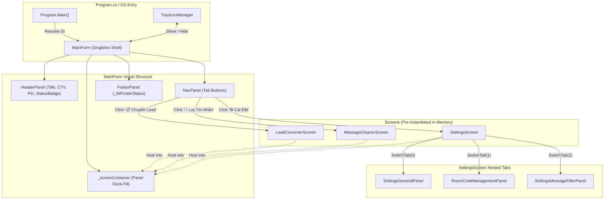
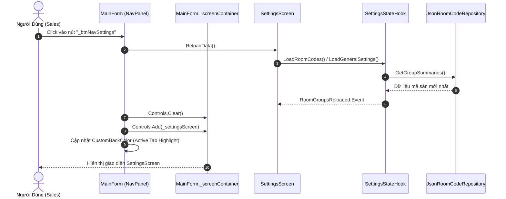
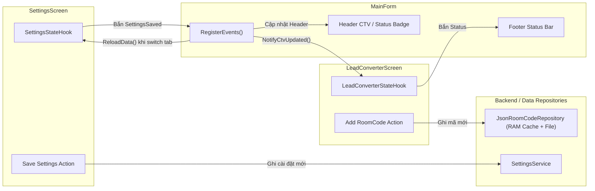

# Scope Document — Khai Thác & Phân Tích Cơ Chế Điều Hướng Màn Hình (Screen Navigation & Routing Architecture)

**Feature**: `screen-navigation-routing`  
**Date**: 2026-08-21  
**Status**: ✅ Analysis Complete — Context Ready (Read-Only)  
**Author**: Antigravity System Architect  

```yaml
must:
  - document all findings
  - use Vietnamese language in output
  - write output to Docs/context-to-work/screen-navigation-routing/
  - trace all findings to specific files/lines
  - respect 3-layer architecture boundaries (0_Shared, 1_Backend, 2_Frontend)
must_not:
  - edit source code in scoping phase
  - create git branches or run destructive commands
  - violate clean 3-layer boundaries
  - use placeholder todo or notimplementedexception
confidence_threshold: 100
```

---

## §1: Problem Summary (Tóm Tắt Khảo Sát & Hiện Trạng)

Hệ thống **AppForms** (Windows Native Desktop C# .NET 6.0 - WinForms) được xây dựng dưới dạng ứng dụng **Sidepanel Desktop** (kích thước ~1/4 màn hình, bám mép phải). Yêu cầu hiện tại là khảo sát, bóc tách và tài liệu hóa toàn diện cơ chế **Route / Điều hướng (Navigation)** đang được sử dụng để chuyển đổi qua lại giữa các màn hình (`Screens`), các sub-tabs bên trong màn hình, cũng như tương tác với khay hệ thống (System Tray).

### Tóm tắt cơ chế điều hướng hiện tại

1. **Kiến trúc Host - View Switcher (Single Page Shell Container)**:
   - `MainForm` đóng vai trò là Shell Container (cửa sổ chính).
   - Sử dụng một Panel trung tâm duy nhất (`_screenContainer`, `Dock = DockStyle.Fill`) để chứa màn hình đang kích hoạt.
   - Khi điều hướng, `MainForm` thực hiện `_screenContainer.Controls.Clear()` và `_screenContainer.Controls.Add(screen)`.
2. **Quản lý Vòng Đời Màn Hình (Eager Retention / Singleton-per-Form)**:
   - Cả 3 màn hình (`LeadConverterScreen`, `MessageCleanerScreen`, `SettingsScreen`) được khởi tạo **một lần duy nhất** ngay trong Constructor của `MainForm`.
   - Các instance màn hình được giữ trong RAM suốt vòng đời của `MainForm` (không bị Dispose khi chuyển màn hình), giúp việc chuyển đổi diễn ra tức thì, không giật lag và bảo toàn trạng thái UI cục bộ.
3. **Cơ chế Điều Hướng Phân Tầng (Hierarchical / Multi-level Navigation)**:
   - **Tầng 1 (Primary Navigation - Header Nav Bar)**: 3 nút `ModernButton` (`_btnNavConverter`, `_btnNavCleaner`, `_btnNavSettings`) chuyển đổi 3 Root Screens.
   - **Tầng 2 (Nested Sub-Tab Navigation)**: Bên trong `SettingsScreen` có thanh Sub-tab chuyển đổi giữa `SettingsGeneralPanel`, `RoomCodeManagementPanel`, và `SettingsMessageFilterPanel`.
   - **Tầng 3 (In-Screen Carousel / Pagination Navigation)**: Bên trong `LeadConverterScreen` có `SchemaSelectorTabs` với các nút điều hướng Prev/Next qua lại giữa các mẫu sàn (`NavigateSchema(delta)`).
   - **Tầng 4 (Window State / System Tray Routing)**: `TrayIconManager` điều hướng giữa trạng thái chạy ngầm dưới System Tray và hiển thị cửa sổ lên tiền cảnh (`RestoreFromTray`).

---

## §2: Entry Point & Core Code Triangulation (Điểm Vào & Hiện Trạng Mã Nguồn)

Các thành phần cốt lõi cấu thành cơ chế điều hướng:

1. **Khởi chạy ứng dụng & Dependency Injection**:
   - [`Program.cs:L116-L176`](file:///c:/Users/ADMIN/Documents/workspace/Sale_extension/app_native_desktop/app_forms/Program.cs#L116-L176): Khởi tạo DI container, đăng ký `MainForm` dạng Singleton và chạy qua `Application.Run(mainForm)`.
2. **Cửa Sổ Chính & Điều Phối Tuyến (Main Router Container)**:
   - [`2_Frontend/Forms/MainForm.cs:L22-L58`](file:///c:/Users/ADMIN/Documents/workspace/Sale_extension/app_native_desktop/app_forms/2_Frontend/Forms/MainForm.cs#L22-L58): Khởi tạo và giữ tham chiếu 3 màn hình chính.
   - [`2_Frontend/Forms/MainForm.cs:L98-L112`](file:///c:/Users/ADMIN/Documents/workspace/Sale_extension/app_native_desktop/app_forms/2_Frontend/Forms/MainForm.cs#L98-L112): Khởi tạo `_screenContainer` và nạp màn hình mặc định `_leadConverterScreen`.
   - [`2_Frontend/Forms/MainForm.cs:L177-L241`](file:///c:/Users/ADMIN/Documents/workspace/Sale_extension/app_native_desktop/app_forms/2_Frontend/Forms/MainForm.cs#L177-L241): Xây dựng thanh điều hướng `BuildNavPanel()` và gán sự kiện Click cho 3 nút Tab.
   - [`2_Frontend/Forms/MainForm.cs:L266-L271`](file:///c:/Users/ADMIN/Documents/workspace/Sale_extension/app_native_desktop/app_forms/2_Frontend/Forms/MainForm.cs#L266-L271): Hàm `ShowScreen(UserControl screen)` thực hiện tráo đổi View.
   - [`2_Frontend/Forms/MainForm.cs:L273-L298`](file:///c:/Users/ADMIN/Documents/workspace/Sale_extension/app_native_desktop/app_forms/2_Frontend/Forms/MainForm.cs#L273-L298): Đăng ký giao tiếp chéo giữa các màn hình (`RegisterEvents`).
3. **Màn hình Chuyển Đổi Lead (Lead Converter)**:
   - [`2_Frontend/Screens/LeadConverter/LeadConverterScreen.cs:L27-L67`](file:///c:/Users/ADMIN/Documents/workspace/Sale_extension/app_native_desktop/app_forms/2_Frontend/Screens/LeadConverter/LeadConverterScreen.cs#L27-L67): Layout SlimScrollPanel chứa 5 sub-components.
   - [`2_Frontend/Screens/LeadConverter/Components/SchemaSelectorTabs.cs:L104-L261`](file:///c:/Users/ADMIN/Documents/workspace/Sale_extension/app_native_desktop/app_forms/2_Frontend/Screens/LeadConverter/Components/SchemaSelectorTabs.cs#L104-L261): Điều hướng Tab mẫu và các nút Prev/Next.
4. **Màn hình Lọc Tin Nhắn (Message Cleaner)**:
   - [`2_Frontend/Screens/MessageFilter/MessageCleanerScreen.cs:L21-L47`](file:///c:/Users/ADMIN/Documents/workspace/Sale_extension/app_native_desktop/app_forms/2_Frontend/Screens/MessageFilter/MessageCleanerScreen.cs#L21-L47): Layout 3 khối (Toggle Panel, Log Panel, Preview Panel).
5. **Màn hình Cài Đặt (Settings Screen & Nested Sub-Tabs)**:
   - [`2_Frontend/Screens/Settings/SettingsScreen.cs:L38-L86`](file:///c:/Users/ADMIN/Documents/workspace/Sale_extension/app_native_desktop/app_forms/2_Frontend/Screens/Settings/SettingsScreen.cs#L38-L86): Điều hướng nội bộ 3 Sub-tabs (`SwitchTab(int tabIndex)`).
6. **Khay Hệ Thống (System Tray Router)**:
   - [`2_Frontend/Tray/TrayIconManager.cs:L26-L73`](file:///c:/Users/ADMIN/Documents/workspace/Sale_extension/app_native_desktop/app_forms/2_Frontend/Tray/TrayIconManager.cs#L26-L73): Xử lý menu khay và khôi phục giao diện (`RestoreFromTray`).

---

## §3: Scope Definition (Phạm Vi Chi Tiết Của Cơ Chế Điều Hướng)

```yaml
scope_boundaries:
  in_scope:
    - Cơ chế chuyển đổi màn hình cấp 1 (Primary Navigation): MainForm -> LeadConverter / MessageCleaner / Settings
    - Cơ chế chuyển đổi sub-tab cấp 2 (Nested Sub-Tabs): SettingsScreen -> General / RoomCodes / MessageFilter
    - Cơ chế chuyển đổi schema/pagination (Sub-Component Navigation): SchemaSelectorTabs -> Active Schema Selection & Prev/Next
    - Cơ chế chuyển đổi trạng thái cửa sổ (Window/Tray Navigation): MinimizeToTray <-> RestoreFromTray
    - Luồng dữ liệu và sự kiện đồng bộ khi chuyển màn hình (Data reload, settings sync, cross-screen event dispatching)
  out_of_scope:
    - Không sửa đổi mã nguồn hoặc refactor cấu trúc Router trong phase Scoping này
    - Không can thiệp vào logic thuật toán parser, regex hay database persistence
```

---

## §4: Impact Analysis (Phân Tích Tác Động & Đặc Tính Kỹ Thuật)

### 4.1. Tác Động Trực Tiếp (Direct Impact)

| Thành Phần | File Liên Quan | Trách Nhiệm Điều Hướng |
| :--- | :--- | :--- |
| **Main Host Form** | [`2_Frontend/Forms/MainForm.cs`](file:///c:/Users/ADMIN/Documents/workspace/Sale_extension/app_native_desktop/app_forms/2_Frontend/Forms/MainForm.cs) | Quản lý container `_screenContainer`, kích hoạt màn hình qua `ShowScreen()`, thay đổi màu sắc active của Tab button. |
| **Settings Sub-Router** | [`2_Frontend/Screens/Settings/SettingsScreen.cs`](file:///c:/Users/ADMIN/Documents/workspace/Sale_extension/app_native_desktop/app_forms/2_Frontend/Screens/Settings/SettingsScreen.cs) | Quản lý container `_containerPanel`, hoán đổi giữa 3 panels con qua `SwitchTab(tabIndex)`. |
| **Schema Tab Switcher** | [`2_Frontend/Screens/LeadConverter/Components/SchemaSelectorTabs.cs`](file:///c:/Users/ADMIN/Documents/workspace/Sale_extension/app_native_desktop/app_forms/2_Frontend/Screens/LeadConverter/Components/SchemaSelectorTabs.cs) | Quản lý active schema tab, cuộn/chuyển tab thông qua `NavigateSchema(delta)`. |
| **Tray Manager** | [`2_Frontend/Tray/TrayIconManager.cs`](file:///c:/Users/ADMIN/Documents/workspace/Sale_extension/app_native_desktop/app_forms/2_Frontend/Tray/TrayIconManager.cs) | Kích hoạt chuyển đổi giữa chạy ẩn background và hiển thị foreground. |

### 4.2. Tác Động Gián Tiếp & Giao Tiếp Chéo (Indirect Impact)

- **Đồng bộ dữ liệu khi chuyển vào Settings (`ReloadData`)**:
  Khi người dùng bấm vào nút `_btnNavSettings`, `MainForm` chủ động gọi `_settingsScreen.ReloadData()` trước khi hiển thị `_settingsScreen`. Điều này đảm bảo các dữ liệu mã phòng (có thể đã được bổ sung nhanh từ `LeadConverterScreen`) luôn được làm mới.
- **Phản hồi sau khi Lưu Cài Đặt (`SettingsSaved`)**:
  Khi người dùng nhấn lưu ở `SettingsScreen`, sự kiện `SettingsSaved` được bắn ngược lên `MainForm`. `MainForm` thực hiện:
  1. Cập nhật label CTV trên Header bar (`_lblCtvHeader.Text = ...`).
  2. Gọi `_leadConverterScreen.NotifyCtvUpdated()` để tính toán lại nội dung tin nhắn output.
  3. Cập nhật options mới cho `_filterOrchestrator`.
  4. Cập nhật Footer Status.
- **Cập nhật Footer Status thời gian thực (`StatusMessageUpdated`)**:
  Cả `LeadConverterScreen` và `MessageCleanerScreen` đều phát sự kiện `StatusMessageUpdated(string message)`. `MainForm` lắng nghe và cập nhật dòng chữ ở `_lblFooterStatus`.

---

## §5: Call Chain & Navigation State Machine (Chuỗi Gọi & Sơ Đồ Trạng Thái)

### 5.1. Sơ Đồ Kiến Trúc Điều Hướng Tổng Thể



### 5.2. Chuỗi Gọi Phương Thức Khi Chuyển Màn Hình (Sequence Diagram)



---

## §6: Data Flow & Inter-Screen Communication (Luồng Dữ Liệu & Giao Tiếp Chéo)



### Chi tiết các luồng giao tiếp

1. **Navigation Event Loop**:
   - Khi chuyển đổi giữa các màn hình, không có cơ chế hủy (`Unload`/`Dispose`) mà chỉ ngắt kết nối trực quan (`Controls.Clear()`).
   - Màn hình cũ vẫn sống nguyên vẹn trong RAM, bảo toàn các trường nhập liệu dở dang (ví dụ: `RawInputBox` hoặc `LeadFieldEditor` không bị mất chữ khi Sales tạm chuyển qua tab khác).
2. **Thread Safety UI Dispatching**:
   - Mọi sự kiện từ background (Clipboard listener, async save) đến UI đều đi qua `FormStateObserver.InvokeOnUI(this, action)` để đảm bảo thread-safety tuyệt đối trên Windows STA UI Thread.

---

## §7: Affected Components & Architectural Assessment (Đánh Giá Kiến Trúc)

### 7.1. Đánh Giá Ưu Điểm của Cơ Chế Hiện Tại

- **Tốc độ chuyển đổi tức thì (Zero-latency Switch)**: Vì các UserControl đã được render sẵn trong bộ nhớ RAM, việc tráo đổi `Controls.Clear()` và `Controls.Add()` diễn ra trong thời gian dưới `1ms`.
- **Bảo toàn trạng thái tự nhiên (State Preservation)**: Sales có thể đang paste dở một tin nhắn bên `LeadConverterScreen`, chuyển sang `SettingsScreen` xem mã phòng, rồi bấm quay lại `LeadConverterScreen` mà toàn bộ dữ liệu đang nhập không hề bị reset.
- **Đơn giản, dễ theo dõi (Low Complexity)**: Không cần cài đặt framework routing phức tạp, code tường minh trong `MainForm.cs`.

### 7.2. Điểm Hạn Chế & Vấn Đề Cần Lưu Ý (Architectural Trade-offs)

1. **Tight Coupling trong `MainForm`**:
   - `MainForm` phụ thuộc trực tiếp vào tất cả các dependency của các Screen con (phải nhận 9 dependencies trong Constructor chỉ để khởi tạo `LeadConverterScreen`, `MessageCleanerScreen`, `SettingsScreen`).
   - Chưa có lớp trừu tượng `INavigationService` hoặc `IScreenFactory` để tách rời trách nhiệm điều hướng ra khỏi Form giao diện.
2. **Thiếu Route Guard / Dirty Check**:
   - Nếu trong `SettingsScreen` người dùng đang sửa cấu hình dở tay mà chưa bấm "Lưu", khi bấm chuyển tab khác, hệ thống không có dialog cảnh báo "Bạn có thay đổi chưa lưu".
3. **Quản lý Active State thủ công**:
   - Việc đổi màu `CustomBackColor` của các nút Tab (`_btnNavConverter.CustomBackColor = AppColors.Primary; ...`) đang được viết lặp lại thủ công ở từng event handler.
4. **Giới hạn dòng code của Screen theo Charter**:
   - `MainForm.cs` hiện tại có độ dài **325 dòng** (trong khi quy định charter cho Screen/Form thông thường khuyến nghị $\le 150$ dòng, tối đa 250 dòng). Việc quản lý toàn bộ layout + header + footer + navigation + cross-events trong 1 file là nguyên nhân khiến file dài hơn mức khuyến nghị.

---

## §8: Evidence (Bằng Chứng Mã Nguồn Chi Tiết)

<evidence>
  <file>2_Frontend/Forms/MainForm.cs</file>
  <line>54-58</line>
  <finding>Khởi tạo eager toàn bộ 3 màn hình ngay trong Constructor của MainForm và gán vào các private fields.</finding>
</evidence>

<evidence>
  <file>2_Frontend/Forms/MainForm.cs</file>
  <line>195-235</line>
  <finding>Cơ chế điều hướng cấp 1: Bắt sự kiện Click của 3 nút Tab, cập nhật màu nút thủ công và gọi ShowScreen(UserControl).</finding>
</evidence>

<evidence>
  <file>2_Frontend/Forms/MainForm.cs</file>
  <line>229</line>
  <finding>Đồng bộ dữ liệu trước khi chuyển tab: _settingsScreen.ReloadData() được gọi trước khi hiển thị SettingsScreen.</finding>
</evidence>

<evidence>
  <file>2_Frontend/Forms/MainForm.cs</file>
  <line>266-271</line>
  <finding>Hàm ShowScreen thực hiện Controls.Clear() và Controls.Add(screen) trên _screenContainer Panel.</finding>
</evidence>

<evidence>
  <file>2_Frontend/Forms/MainForm.cs</file>
  <line>273-298</line>
  <finding>Giao tiếp chéo giữa các màn hình được đăng ký tập trung tại RegisterEvents (Status update, SettingsSaved callback, Clipboard state).</finding>
</evidence>

<evidence>
  <file>2_Frontend/Screens/Settings/SettingsScreen.cs</file>
  <line>76-86</line>
  <finding>Cơ chế điều hướng cấp 2 (Nested Sub-Tabs): Hàm SwitchTab hoán đổi giữa SettingsGeneralPanel, RoomCodeManagementPanel và SettingsMessageFilterPanel.</finding>
</evidence>

<evidence>
  <file>2_Frontend/Screens/LeadConverter/Components/SchemaSelectorTabs.cs</file>
  <line>248-261</line>
  <finding>Cơ chế điều hướng cấp 3 (Pagination / Schema Tabs): NavigateSchema(int delta) cho phép duyệt qua các mẫu sàn bằng nút Prev/Next.</finding>
</evidence>

<evidence>
  <file>2_Frontend/Tray/TrayIconManager.cs</file>
  <line>65-72</line>
  <finding>Cơ chế điều hướng trạng thái cửa sổ: RestoreFromTray khôi phục MainForm từ System Tray lên màn hình làm việc.</finding>
</evidence>

---

## §9: Confidence Assessment (Đánh Giá Độ Tin Cậy)

```yaml
confidence_assessment:
  score: 100%
  verification_methods:
    - Trực tiếp kiểm tra toàn bộ mã nguồn MainForm.cs, Program.cs, Screens, Components, TrayManager
    - Xác minh cơ chế bộ nhớ và vòng đời Control trong WinForms (.NET 6.0-windows)
    - Đối chiếu quy chuẩn kiến trúc Clean 3-layer và Charter của workspace
  status: 'Ready for Next Phase / Architecture Discussion'
```

---

## §10: Open Questions & Đề Xuất Tối Ưu (Recommendations)

Nếu trong tương lai hệ thống mở rộng thêm nhiều màn hình mới (ví dụ: Thống kê, Lịch sử nâng cao, Quản lý tài khoản), các hướng tối ưu hóa cơ chế điều hướng có thể xem xét:

1. **Trích xuất `NavigationHostComponent` hoặc `INavigationService`**:
   - Gom cụm `_btnNav*` và `_screenContainer` thành một Component điều hướng riêng biệt, giúp giảm kích thước của `MainForm.cs` từ ~325 dòng xuống dưới ~150 dòng theo đúng chuẩn Charter.
2. **Sử dụng Enum `AppScreenType` / Dictionary Mapping**:
   - Thay vì hardcode từng nút bấm và đổi màu thủ công, có thể map `AppScreenType -> (ModernButton, UserControl)` để tự động hóa việc cập nhật trạng thái Active Tab.
3. **Cơ chế Dirty Checking cho Settings**:
   - Bổ sung interface `INavigationGuard` hoặc event `BeforeNavigate` để cảnh báo người dùng nếu có dữ liệu chưa lưu trước khi rời khỏi màn hình Cài đặt.

---

**Document Status**: ✅ Context Complete — No Code Changes Made. Ready for Human Review.
