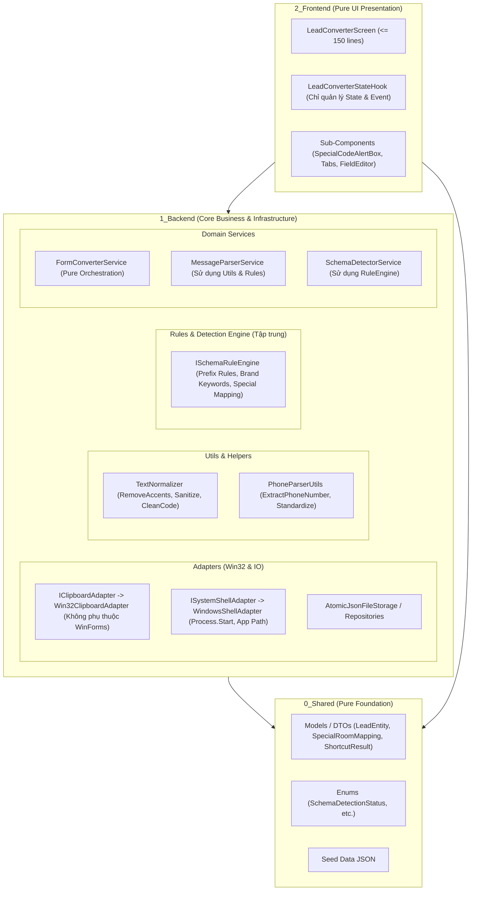

Dựa trên tài liệu [`02_Special_Room_Mapping_Mindmap.md`](Docs/Maps/02_Special_Room_Mapping_Mindmap.md) và toàn bộ mã nguồn hiện tại của dự án `app_forms`, dưới đây là bản phân tích toàn diện về **Pattern hiện tại**, **Các vị trí vi phạm kiến trúc / SRP**, và **Đề xuất tái cấu trúc (Refactoring Plan)** hướng đến chuẩn Clean Architecture.

---

## 1. 🏛️ PHÂN TÍCH PATTERN ĐANG SỬ DỤNG TRONG DỰ ÁN

Dự án hiện đang áp dụng kiến trúc kết hợp gồm các pattern chính:

1. **Clean 3-Layer Architecture**:
   - **`0_Shared`**: POCO DTOs, Enums, Constants, Seed JSON Data.
   - **`1_Backend`**: Core Business Logic, Contracts (Interfaces/Entities), Adapters (Persistence, Win32), Services. Tuyệt đối không phụ thuộc WinForms UI.
   - **`2_Frontend`**: Presentation Layer (Screens, Sub-Components, State Hooks, UI Theme).
2. **Component-Driven UI & Hook Pattern (Presentation Layer)**:
   - **Root Screen** mỏng ($\le 150$ dòng): Chỉ khởi tạo layout và lắng nghe event từ Hook.
   - **State Hook** (`*StateHook.cs`): Đóng gói toàn bộ reactive state, dispatch event thay đổi (`event Action`), không chứa UI Controls.
   - **Sub-Components** ($\le 300$ dòng): Nhận dữ liệu qua `BindData(...)` và bắn event tương tác ngược lên Hook/Screen.
3. **Repository Pattern & In-Memory $O(1)$ Dual Indexing**:
   - Quản lý nạp dữ liệu từ JSON Storage, build 2 bảng băm `ConcurrentDictionary` (`_codeIndex`, `_phoneIndex`) để tra cứu tức thì $O(1)$.
4. **Rule Engine & Chain of Rules**:
   - Điều phối thứ tự ưu tiên nhận diện tiền tố (`CPrefixTL21SpecialRule` - Priority 100, `StandardPrefixRules` - Priority 50).
5. **Atomic File Persistence**:
   - Ghi dữ liệu ra file tạm `.tmp` $\to$ Lock thread $\to$ `File.Copy(overwrite: true)` để chống hỏng file khi crash/mất điện.

---

## 2. 🚨 CÁC VỊ TRÍ VI PHẠM PATTERN & SINGLE RESPONSIBILITY (SRP)

Qua rà soát mã nguồn, có **4 nhóm vi phạm cốt lõi** cần được bóc tách và quy hoạch lại:

### ❌ Vi phạm 1: Vi phạm ranh giới phân tầng (Backend phụ thuộc WinForms UI)

Theo Charter: *`1_Backend/` tuyệt đối không import hoặc thao tác trực tiếp với WinForms UI Controls & WinForms Classes.*

- **[`FormConverterService.cs:L142-L173`](1_Backend/Services/FormConverterService.cs#L142-L173)**: Gọi trực tiếp `System.Windows.Forms.Clipboard` (`Clipboard.SetText`, `Clipboard.ContainsText()`, `Clipboard.GetText()`). Backend service lại phụ thuộc trực tiếp vào thư viện UI WinForms thay vì qua một Adapter/Abstraction.
- **[`System.Shortcut.Desktop.Service.cs:L277`](1_Backend/Shortcut/System.Shortcut.Desktop.Service.cs#L277)**: Sử dụng `System.Windows.Forms.Application.ExecutablePath`.

### ❌ Vi phạm 2: Phân tán quy tắc nghiệp vụ (Scattered Domain Rules - Vi phạm SRP & DRY)

Logic nhận diện sàn/thương hiệu và bóc tách mã phòng đang bị xé lẻ và viết lặp lại ở 4 nơi:

1. **[`MessageParserService.cs:L140`](1_Backend/Services/MessageParserService.cs#L140)**: Tự hardcode Regex quét mã thương hiệu (`mn`, `ts`, `nt`, `95`, `tl`, `c`...).
2. **[`SchemaDetectorService.cs:L72-L80`](1_Backend/Services/SchemaDetectorService.cs#L72-L80)**: Lặp lại Regex kiểm tra mã phòng (`\bmn\s*\d+`, `\bts\s*\d+`, `\bnt\s*\d+`).
3. **[`SchemaDetectorService.cs:L92-L108`](1_Backend/Services/SchemaDetectorService.cs#L92-L108)**: Hardcode danh sách sàn (`lusaco`, `hd_homes`, `tl21_house`...) trong hàm `DetectFromKeyword` thay vì lấy động từ `ISchemaManager` hoặc Rule Registry.
4. **[`SpecialRoomCodeRuleEngine.cs`](1_Backend/Services/Rules/SpecialRoomCodeRuleEngine.cs)**: Lại có các Rule riêng độc lập.

### ❌ Vi phạm 3: Ôm đồm trách nhiệm ngoài luồng (Hook ôm logic OS Shell & Clipboard)

- **[`LeadConverterStateHook.cs:L235-L256`](2_Frontend/Screens/LeadConverter/Hooks/LeadConverterStateHook.cs#L235-L256)**:
  - Chứa hàm `OpenUrl` trực tiếp gọi `Process.Start` để mở trình duyệt.
  - Chứa hàm `CopyTextToClipboard` gọi ngược `_converterService.CopyToClipboard`.
  - *Vấn đề*: StateHook là Presentation State Manager (quản lý state phản ứng của Screen), không phải nơi thực thi tương tác tầng OS / System Shell.

### ❌ Vi phạm 4: Sai quy chuẩn tổ chức thư mục & Naming Convention

- **Thư mục `1_Backend/Shortcut/`**:
  - Đặt tên file dạng chấm: `System.Shortcut.Desktop.Contract.cs`, `System.Shortcut.Desktop.Model.cs`, `System.Shortcut.Desktop.Service.cs`.
  - Gom chung Model, Contract và Service vào một thư mục con, không tuân thủ cấu trúc phân tầng (`0_Shared/Models/`, `1_Backend/Contracts/Interfaces/`, `1_Backend/Adapters/`).

### ❌ Vi phạm 5: Trùng lặp mã tiện ích xử lý chuỗi (String Utility Duplication)

- Các hàm như `NormalizeLabel`, `RemoveAccents`, `CleanCode`, `ExtractPhoneNumber` đang được viết riêng lẻ, lặp lại trong:
  - [`MessageParserService.cs:L182-L209`](1_Backend/Services/MessageParserService.cs#L182-L209)
  - [`SchemaDetectorService.cs:L110-L130`](1_Backend/Services/SchemaDetectorService.cs#L110-L130)
  - [`SpecialMappingTextParser.cs:L55-L70`](1_Backend/Services/SpecialMappingTextParser.cs#L55-L70)

---

## 3. 🎯 ĐỀ XUẤT KIẾN TRÚC MỤC TIÊU (REFACTORING BLUEPRINT)

---

## 4. 📋 BẢNG ÁNH XẠ KẾ HOẠCH BÓC TÁCH & TÁI CẤU TRÚC

| Thành phần | Hiện trạng | Hướng giải quyết / Vị trí chuẩn mới | Lợi ích thu được |
| :--- | :--- | :--- | :--- |
| **Clipboard Access** | `FormConverterService` dùng `WinForms.Clipboard`. | Tạo `IClipboardAdapter` tại `1_Backend/Adapters/Win32/` hoặc xử lý thuần qua Win32 API. | Tách đứt hoàn toàn dependency WinForms khỏi Backend. |
| **OS Launcher & Path** | `LeadConverterStateHook` gọi `Process.Start`, `ShortcutService` gọi `Application.ExecutablePath`. | Tạo `ISystemLauncherAdapter` (`1_Backend/Adapters/Win32/`) xử lý mở URL, lấy Exe Path an toàn bằng `Environment.ProcessPath`. | StateHook chỉ lo State, Backend không phụ thuộc WinForms `Application`. |
| **Shortcut Module** | Nằm trong `1_Backend/Shortcut/System.Shortcut.*`. | • Model $\to$ `0_Shared/Models/Shortcut/ShortcutResult.cs` • Contract $\to$ `1_Backend/Contracts/Interfaces/IDesktopShortcutService.cs` • Service $\to$ `1_Backend/Adapters/Win32/DesktopShortcutService.cs`. | Tuân thủ 100% quy chuẩn tổ chức thư mục & Clean Layered. |
| **String & Phone Utils** | Lặp lại ở 3 file (`MessageParser`, `SchemaDetector`, `SpecialMappingTextParser`). | Gom về `1_Backend/Utils/TextNormalizer.cs` & `PhoneNumberUtils.cs`. | Giảm trùng lặp, dễ viết Unit Test độc lập. |
| **Brand & Prefix Rules** | Rải rác ở `MessageParser`, `SchemaDetector`, `SpecialRoomCodeRuleEngine`. | Tích hợp tập trung vào `RuleEngine` / `ISpecialRoomCodeRule`, `SchemaDetectorService` chỉ gọi qua Engine. | Tuân thủ OCP (Open-Closed Principle), khi thêm sàn mới chỉ sửa 1 nơi. |
| **Component Size** | `SchemaSelectorTabs.cs` 304 dòng. | Bóc tách phần `Dropdown Navigation` / `Badge Renderer` thành sub-helper hoặc thu gọn layout logic. | Giữ Sub-Components luôn $\le 300$ dòng chuẩn Charter. |

---
