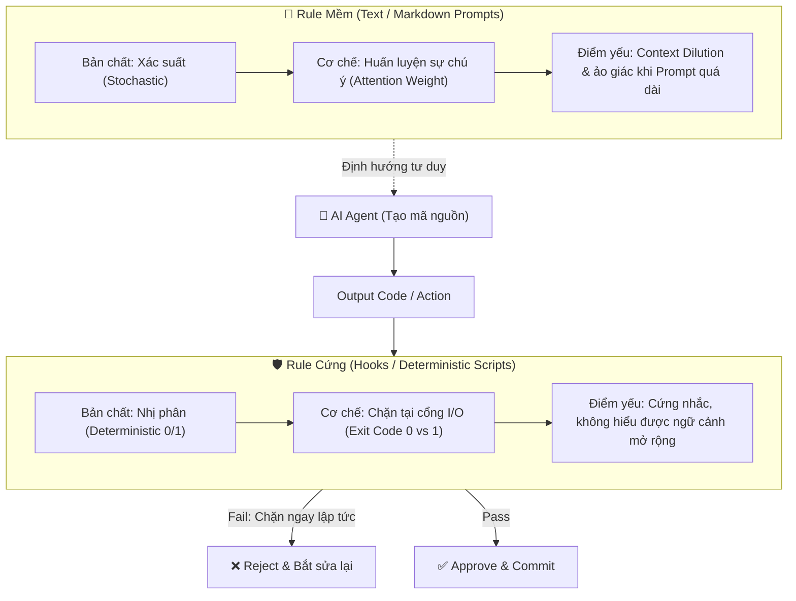
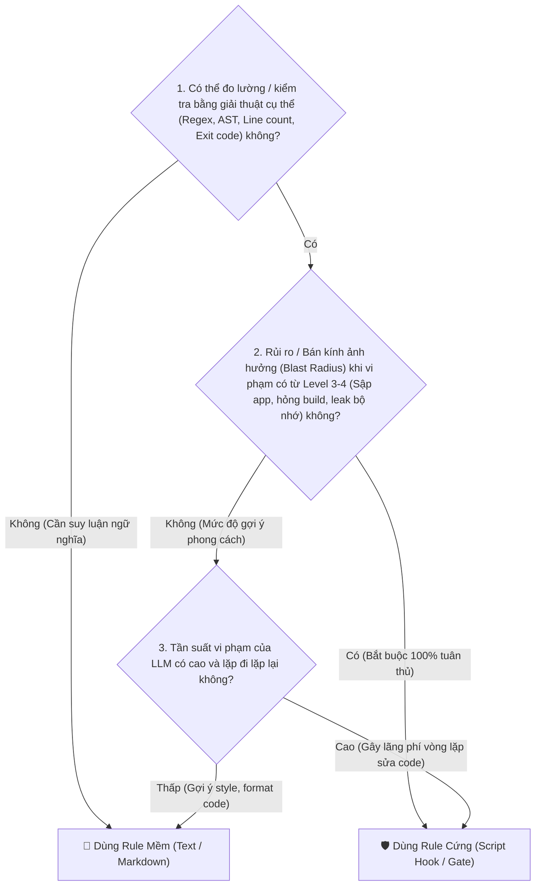
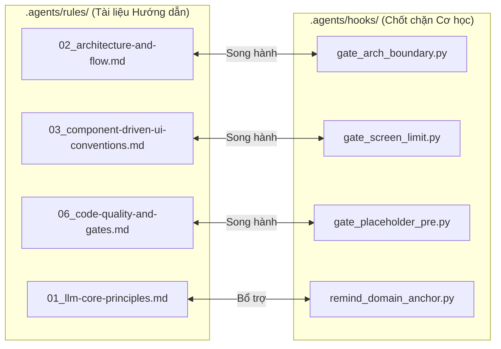

Viewed SKILL.md:1-150
Listed directory rules
Listed directory hooks
Viewed rules.yaml:1-32
Viewed gate_arch_boundary.py:1-68
Viewed 06_code-quality-and-gates.md:1-49
Viewed remind_domain_anchor.py:1-30
Viewed trade-off-dimensions.md:1-71
Viewed decision-reversibility.md:1-62

# 🏛️ Báo Cáo Phân Tích Đánh Đổi Kiến Trúc: Thiết Kế Rule Mềm (Prompt) vs Rule Cứng (Hooks/Gates) Cho AI Agents

> **Được thực hiện bởi:** Senior Systems Architect & Technical Trade-off Specialist (theo tiêu chuẩn [`technical-tradeoff-analyzer`](file:///c:/Users/ADMIN/Documents/workspace/Sale_extension/app_native_desktop/app_forms/.agents/skills/technical-tradeoff-analyzer/SKILL.md)).
> **Ngữ cảnh kiểm chứng:** Hệ thống workspace [`.agents/rules`](file:///c:/Users/ADMIN/Documents/workspace/Sale_extension/app_native_desktop/app_forms/.agents/rules) và [`.agents/hooks`](file:///c:/Users/ADMIN/Documents/workspace/Sale_extension/app_native_desktop/app_forms/.agents/hooks).

## 1. Bản Chất Từ Nguyên Lý Đầu Tiên (First Principles)

Trong quá trình điều khiển và định hướng AI Agent (LLM), bản chất của hai phương thức kiểm soát này khác nhau hoàn toàn về mặt vật lý:



1. **Rule mềm (Text Rules trong [`.agents/rules`](file:///c:/Users/ADMIN/Documents/workspace/Sale_extension/app_native_desktop/app_forms/.agents/rules))**:
 - **Bản chất**: Mang tính **xác suất (probabilistic)**. LLM tiếp nhận như một chỉ dẫn ngữ nghĩa để "điều hướng vector chú ý".
 - **Ưu thế**: Linh hoạt, hiểu được sắc thái ngữ nghĩa (nuance), giải thích được lý do tại sao, hướng dẫn cách tư duy giải quyết vấn đề phức tạp.
 - **Giới hạn**: Không bao giờ đảm bảo tính tuân thủ 100%. Khi context dài hoặc gặp edge-cases phức tạp, hiện tượng *Context Drift* và *Prompt Fatigue* sẽ xảy ra.
2. **Rule cứng / Gate chặn (Script Hooks trong [`.agents/hooks`](file:///c:/Users/ADMIN/Documents/workspace/Sale_extension/app_native_desktop/app_forms/.agents/hooks))**:
 - **Bản chất**: Mang tính **tất định nhị phân (deterministic boolean)**. Đúng là qua (`exit 0`), sai là chặn đứng (`exit 1`).
 - **Ưu thế**: Độ tin cậy 100%, bảo vệ tuyệt đối các ranh giới sống còn (Security, Build Integrity, Clean Boundaries) mà không cần bận tâm LLM "quên" hay "ảo giác".
 - **Giới hạn**: Cần chi phí lập trình script, chỉ kiểm tra được những thứ có thể quy đổi ra giải thuật/mẫu hình cụ thể (computable patterns).

## 2. Khung Nhận Diện: Khi Nào Dùng Rule Mềm vs Khi Nào Dùng Rule Cứng?

Để quyết định một quy tắc nên viết dưới dạng **Text Rule** hay lập trình thành **Hook Script**, ta dựa vào **4 tiêu chí định lượng**:



### Bảng Tiêu Chí Phân Định Chi Tiết:

| Đặc Tính | 📝 Khi Nào Nên Dùng Rule Mềm (Text) | 🛡️ Khi Nào Phải Dùng Rule Cứng (Hook Script) |
| :--- | :--- | :--- |
| **Tính khả toán (Computability)** | Quy tắc mang tính **đánh giá chủ quan** hoặc ngữ cảnh mở rộng (ví dụ: *Tên biến phải có ý nghĩa*, *Thiết kế API theo phong cách RESTful*). | Quy tắc có thể **định lượng chính xác** (ví dụ: *Không chứa `NotImplementedException`*, *Screen $\le 150$ dòng*). |
| **Phân loại quyết định** | **Type 2 Decision (Khả nghịch)**: Vi phạm chỉ ảnh hưởng nhỏ đến style, dễ sửa sau đó. | **Type 1 Decision (Bất khả nghịch)**: Vi phạm làm hỏng kiến trúc tầng, vỡ Data Model hoặc lỗi compile. |
| **Bán kính ảnh hưởng (Blast Radius)** | Level 1: Lỗi cục bộ, không gây crash ứng dụng. | Level 3 - Level 4: Crash runtime, compile error, vi phạm ranh giới phân tầng clean 3-layer. |
| **Mục đích tương tác** | **Hướng dẫn (Guiding & Teaching)**: Giúp LLM biết *phải làm như thế nào* và *tại sao làm vậy*. | **Thực thi kỷ luật (Enforcing & Gating)**: Đóng vai trò là bức tường thành ngăn chặn code lỗi đi vào codebase. |

## 3. Ma Trận Đánh Đổi 6 Chiều (Multi-Dimensional Trade-off Matrix)

| Trục Đánh Đổi | Phương Án 1: Chỉ Dùng Rule Mềm (Pure Text Prompts) | Phương Án 2: Chỉ Dùng Rule Cứng (Pure Script Hooks) | Phương Án 3: Kiến Trúc Phòng Thủ Kép (Dual-Layer: Soft + Hard) |
| :--- | :--- | :--- | :--- |
| **1. Độ tin cậy (Enforcement Safety)** | 🔴 Thấp (70% - 90%, phụ thuộc mô hình & độ dài context) | 🟢 Tuyệt đối (100% không cho code lỗi đi qua) | 🟢 **Tuyệt đối**: Rule mềm giảm tỷ lệ lỗi lúc sinh code, Hook cứng bắt dính 100% lỗi sót lại. |
| **2. Độ phức tạp duy trì (Cognitive & Dev Cost)** | 🟢 Cực thấp (Chỉ cần viết file `.md`) | 🔴 Cao (Phải code Python/Bash/Regex để parse file) | 🟡 **Cân bằng**: Chỉ viết Hook cho 5-7 quy tắc cốt lõi mang tính sống còn. |
| **3. Token Consumption & Latency** | 🔴 Tốn context window nếu viết quá nhiều rules text | 🟢 Tiết kiệm token (chỉ chạy script ngoại vi khi trigger) | 🟢 **Tối ưu**: Rule text giữ ngắn gọn định hướng, Hook script chạy sau nền tảng. |
| **4. Ranh giới kiến trúc (Modularity)** | 🟡 Dễ bị vi phạm âm thầm nếu prompt bị trôi | 🟢 Ngăn chặn ngay lập tức tại ranh giới tầng | 🟢 **Bảo vệ toàn vẹn** Clean 3-layer boundaries. |
| **5. Khả năng kiểm thử (Testability)** | 🔴 Khó kiểm thử tự động xem AI có "hiểu" prompt không | 🟢 Test được 100% bằng script unit tests | 🟢 **Dễ dàng kiểm chứng** tính hiệu lực của Gate. |
| **6. Trải nghiệm tương tác (DX & Feedback Loop)** | 🟡 AI không biết mình sai ở đâu trừ khi user nhắc | 🔴 Nếu không có giải thích, AI sẽ bế tắc không biết cách sửa | 🟢 **Lý tưởng**: Hook in ra lỗi cụ thể + trỏ về Rule text để AI tự sửa. |

## 4. Kiểm Chứng Thực Tế Trong Workspace AppForms

Tại workspace hiện tại của bạn, mô hình **Phòng thủ kép (Dual-Layer Defense)** đã được định hình xuất sắc qua sự kết hợp giữa các rule text trong [`.agents/rules`](file:///c:/Users/ADMIN/Documents/workspace/Sale_extension/app_native_desktop/app_forms/.agents/rules) và các gate script trong [`.agents/hooks`](file:///c:/Users/ADMIN/Documents/workspace/Sale_extension/app_native_desktop/app_forms/.agents/hooks):



### Bóc tách các cặp song hành cụ thể:

### 1. Ranh giới kiến trúc phân tầng (Clean 3-Layer Boundaries)
- **Rule Mềm**: [`02_architecture-and-flow.md`](file:///c:/Users/ADMIN/Documents/workspace/Sale_extension/app_native_desktop/app_forms/.agents/rules/02_architecture-and-flow.md) giải thích triết lý tại sao `1_Backend` không được phụ thuộc WinForms UI.
- **Rule Cứng**: [`gate_arch_boundary.py`](file:///c:/Users/ADMIN/Documents/workspace/Sale_extension/app_native_desktop/app_forms/.agents/hooks/gate_arch_boundary.py) phân tích AST/Regex dòng `using System.Windows.Forms;` trong các file `1_Backend/`. Nếu phát hiện, script trả về `exit 1` và từ chối lưu file.

### 2. Chất lượng mã nguồn không Placeholder (Zero-Stub Policy)
- **Rule Mềm**: [`06_code-quality-and-gates.md`](file:///c:/Users/ADMIN/Documents/workspace/Sale_extension/app_native_desktop/app_forms/.agents/rules/06_code-quality-and-gates.md) nêu rõ tiêu chuẩn cấm để lại `TODO` hoặc hàm rỗng.
- **Rule Cứng**: [`gate_placeholder_pre.py`](file:///c:/Users/ADMIN/Documents/workspace/Sale_extension/app_native_desktop/app_forms/.agents/hooks/gate_placeholder_pre.py) quét các pattern cấm được cấu hình trong [`rules.yaml`](file:///c:/Users/ADMIN/Documents/workspace/Sale_extension/app_native_desktop/app_forms/.agents/hooks/rules.yaml) (`throw new NotImplementedException`, `Console.WriteLine`).

### 3. Kích thước Screen & UI Component (Maintainability Limit)
- **Rule Mềm**: [`03_component-driven-ui-conventions.md`](file:///c:/Users/ADMIN/Documents/workspace/Sale_extension/app_native_desktop/app_forms/.agents/rules/03_component-driven-ui-conventions.md) hướng dẫn cách tách UI thành `Components/` và `Hooks/` khi giao diện phình to.
- **Rule Cứng**: [`gate_screen_limit.py`](file:///c:/Users/ADMIN/Documents/workspace/Sale_extension/app_native_desktop/app_forms/.agents/hooks/gate_screen_limit.py) đếm dòng vật lý thực tế: Root Screen vượt $150$ dòng hoặc Component vượt $300$ dòng sẽ bị chặn ngay lập tức.

### 4. Bơm ngữ cảnh nghiệp vụ cốt lõi (Context Ingestion Hook)
- **Hook Hỗ trợ**: [`remind_domain_anchor.py`](file:///c:/Users/ADMIN/Documents/workspace/Sale_extension/app_native_desktop/app_forms/.agents/hooks/remind_domain_anchor.py) không đóng vai trò chặn lỗi (gate) mà đóng vai trò **Active Reminder** — tự động in ra dữ liệu cốt lõi (Lead Form, Room Codes, Schemas) vào luồng thực thi để AI không bị quên Domain.

## 5. Phản Biện Ngược (Reverse Probing): 4 Cạm Bẫy Khi Thiết Kế Hooks

Khi xây dựng Hook/Gate cho AI Agent, nếu thiết kế không chuẩn sẽ dẫn đến các **Failure Modes** sau:

1. **Failure Mode 1: The "Silent Loop Deadlock" (Vòng lặp sửa sai vô tận)**:
 - *Hiện tượng*: Hook trả về lỗi `exit 1` nhưng thông báo lỗi quá ngắn ngủi (ví dụ: `Error: Validation failed`). AI không hiểu sai ở dòng nào và vi phạm quy tắc gì, dẫn đến AI thử sửa ngẫu nhiên và bị chặn lặp đi lặp lại.
 - *Phòng ngừa*: Hook bắt buộc phải in ra: **(1) File & Dòng vi phạm**, **(2) Nội dung vi phạm**, **(3) Hướng dẫn cách khắc phục cụ thể** (trỏ tới file rule tương ứng).
2. **Failure Mode 2: The "Over-Constrained Gate" (Chốt chặn quá chặt làm tê liệt sáng tạo)**:
 - *Hiện tượng*: Biến toàn bộ quy tắc style/formatting thành Hard Gate khiến AI không thể viết nổi một đoạn code thử nghiệm đơn giản.
 - *Phòng ngừa*: Chỉ đặt Hard Gate cho **Negative Constraints sống còn** (Build pass, Layer Boundary, Security, No Placeholder). Các vấn đề về logic nghiệp vụ hãy để cho Unit Test và Rule mềm xử lý.
3. **Failure Mode 3: The "Slow Hook Bottleneck" (Hook chạy quá chậm làm đơ luồng làm việc)**:
 - *Hiện tượng*: Mỗi khi sửa 1 file, hook lại chạy toàn bộ test suite tốn 30 giây.
 - *Phòng ngừa*: Phân cấp Hook: Pre-save hook chỉ kiểm tra tĩnh (Regex/AST $< 50\text{ms}$), Stop/Post-task hook mới chạy build & test tổng thể (`dotnet build`).
4. **Failure Mode 4: The "False Positive Rejection" (Chặn nhầm mã nguồn hợp lệ)**:
 - *Hiện tượng*: Quét chuỗi `TODO` quá đà khiến chuỗi `// TODO: Document why this regex handles edge case` trong comment giải thích cũng bị chặn.
 - *Phòng ngừa*: Dùng regex có ngữ cảnh rõ ràng (ví dụ: `// TODO: Implement` hoặc `throw new NotImplementedException`).

## 6. Quy Trình 4 Bước Chuẩn Hóa Để Ra Quyết Định Biến Rule Thành Hook

Khi bạn muốn thêm một quy tắc mới vào hệ thống Agent, hãy đi qua Checklist này:

```
[ ] Bước 1: Viết quy tắc đó thành Rule Mềm trong .agents/rules/*.md trước.
 Quan sát xem AI có thường xuyên tuân thủ tự nhiên không.

[ ] Bước 2: Đánh giá tần suất vi phạm và rủi ro.
 - Nếu AI tuân thủ tốt (>95%) hoặc rủi ro thấp -> Giữ nguyên ở Rule Mềm.
 - Nếu AI hay quên (>20% vi phạm) HOẶC nếu vi phạm sẽ làm gãy kiến trúc/sập app -> Chuyển sang Bước 3.

[ ] Bước 3: Kiểm tra tính khả toán (Computability).
 - Quy tắc có thể kiểm tra bằng: Regex, Line count, File AST, Import using, hay dotnet build không?
 - Nếu CÓ -> Viết script kiểm tra trong .agents/hooks/gate_*.py.

[ ] Bước 4: Thiết lập thông điệp phản hồi (Actionable Error Message).
 - Đảm bảo script in ra thông báo rõ ràng kèm gợi ý cách sửa để AI tự sửa được trong lần thử tiếp theo.
```

### Tóm Lược Quyết Định

> **Quy tắc vàng:**
> **"Rule mềm để dạy AI Agent CÁCH NGHĨ và ĐỊNH HƯỚNG GIẢI PHÁP — Rule cứng (Hooks/Gates) để ĐẢM BẢO KỶ LUẬT KIẾN TRÚC và KHÔNG THỂ BỊ XUYÊN THỦNG."**