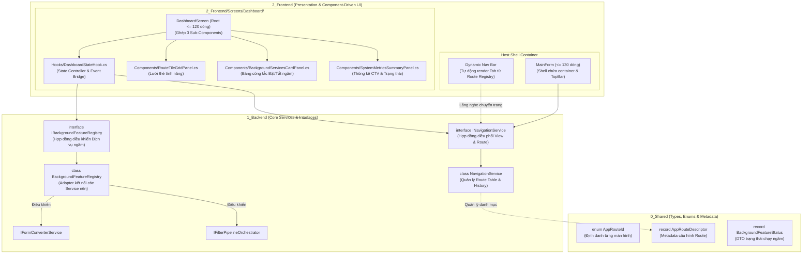
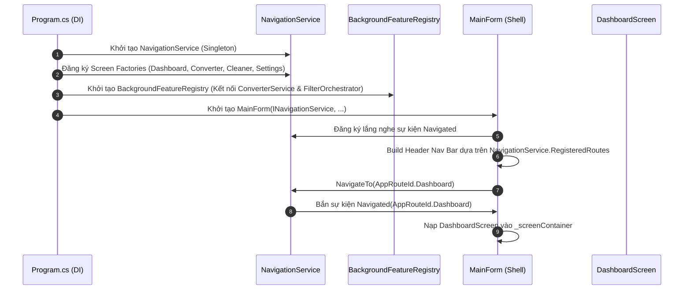
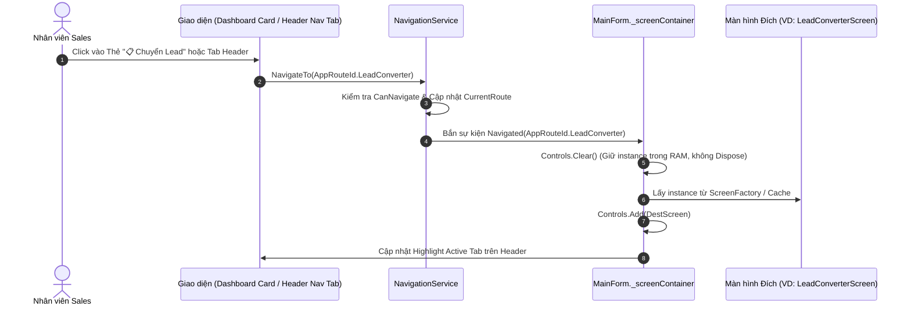
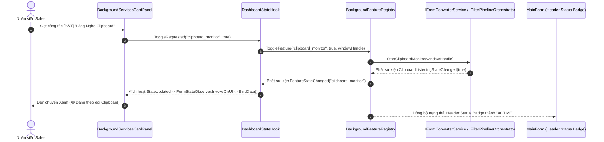
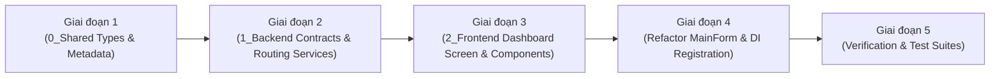

# 🏛️ ĐẶC TẢ KIẾN TRÚC & LUỒNG LOGIC: ROUTE-CONFIG & DASHBOARD CONTROL HUB

> **Phân loại kiến trúc:** Clean 3-Layered & Component-Driven UI (.NET 6.0-windows)  
> **Mục tiêu:** Đặc tả kiến trúc điều hướng tập trung (Route-Config Engine) và Trung tâm điều khiển Dashboard Home (Quản lý trạng thái & Bật/Tắt dịch vụ chạy ngầm).  
> **Trọng tâm tài liệu:** Tập trung vào **Mô hình kiến trúc, Phân định ranh giới, Đặc tả hợp đồng (Contracts) và Luồng xử lý logic (Data Flows)**; loại bỏ toàn bộ code mẫu để tránh rủi ro sai lệch khi triển khai.

---

## 1. 🎯 Mục Tiêu & Nguyên Tắc Thiết Kế Cốt Lõi

### 1.1. Mục Tiêu Cốt Lõi
1. **Tách rời hoàn toàn điều hướng khỏi Shell Container**: Chuyển trách nhiệm quản lý màn hình và hoán đổi View từ [`MainForm.cs`](file:///c:/Users/ADMIN/Documents/workspace/Sale_extension/app_native_desktop/app_forms/2_Frontend/Forms/MainForm.cs) sang `INavigationService` chuyên biệt.
2. **Quản lý Route tập trung (Route-Config Pattern)**: Tương đương mô hình Route Registry trong web framework, định nghĩa metadata (Tiêu đề, Icon, Nhóm tính năng, Có chạy ngầm hay không) tại một điểm duy nhất.
3. **Màn hình Dashboard đóng vai trò Home Hub**:
   - **Lối tắt điều hướng (Quick Launchpad)**: Khởi chạy nhanh các màn hình chức năng.
   - **Bảng điều khiển chạy ngầm (Background Service Switchboard)**: Quan sát trạng thái Live và can thiệp Bật / Tắt trực tiếp các dịch vụ nền (`Clipboard Monitor`, `Filter Pipeline`).
   - **Thông tin hệ thống & CTV**: Hiển thị tên CTV đang làm việc, mức sử dụng tài nguyên và trạng thái sẵn sàng.
4. **Tuân thủ AppForms Charter**:
   - `0_Shared` (Chỉ chứa pure data/enums/DTOs) $\to$ `1_Backend` (Core services, cấm WinForms controls) $\to$ `2_Frontend` (Forms, Screens, Components, Hooks).
   - Root Screen $\le 150$ dòng; Sub-Components $\le 250$ dòng; 100% Thread-safe qua `FormStateObserver.InvokeOnUI`.

---

## 2. 🏛️ Sơ Đồ Kiến Trúc Hệ Thống (Architecture Blueprint)



---

## 3. 📂 Quy Hoạch Phân Tầng & Trách Nhiệm Thành Phần

```text
app_forms/
├── 0_Shared/
│   ├── Enums/
│   │   └── AppRouteId.cs                         # Định danh các Route: Dashboard, LeadConverter, MessageCleaner, Settings
│   └── Models/Routing/
│       ├── AppRouteDescriptor.cs                 # Metadata: Title, Icon, Order, ShowInNav, HasBackgroundService
│       └── BackgroundFeatureStatus.cs            # DTO: FeatureId, Name, Icon, IsRunning, LastActivityTime
│
├── 1_Backend/
│   ├── Contracts/Interfaces/
│   │   ├── INavigationService.cs                 # Contract: NavigateTo, CanNavigate, ResolveScreen, Event Navigated
│   │   └── IBackgroundFeatureRegistry.cs         # Contract: GetAllStatuses, ToggleFeature, Event StateChanged
│   └── Services/Routing/
│       ├── NavigationService.cs                  # Quản lý Route Stack, kích hoạt View Switcher tức thì
│       └── BackgroundFeatureRegistry.cs          # Adapter điều khiển IFormConverterService & IFilterPipelineOrchestrator
│
└── 2_Frontend/
    ├── Forms/
    │   └── MainForm.cs                           # Shell Form rút gọn (<= 130 dòng), delegate tráo View cho Router
    └── Screens/Dashboard/                        # Module Màn hình Dashboard / Home Hub
        ├── Components/
        │   ├── RouteTileGridPanel.cs             # Sub-Component: Thẻ Card tính năng (Click để chuyển Route)
        │   ├── BackgroundServicesCardPanel.cs    # Sub-Component: Công tắc Toggle BẬT/TẮT dịch vụ ngầm
        │   └── SystemMetricsSummaryPanel.cs      # Sub-Component: Thống kê trạng thái hệ thống, CTV Name
        ├── Hooks/
        │   └── DashboardStateHook.cs             # State Controller: Quản lý trạng thái và kết nối Backend
        ├── Models/
        │   └── DashboardFormModel.cs             # DTO hiển thị dữ liệu riêng cho Dashboard UI
        └── DashboardScreen.cs                    # Root Screen ghép nối Layout (<= 120 dòng)
```

---

## 4. 📐 Đặc Tả Hợp Đồng Giao Tiếp (Interface & Contract Specifications)

### 4.1. Tầng `0_Shared/` (Data Contracts)
- **`AppRouteId` (Enum)**: Định danh tập trung các màn hình (`Dashboard`, `LeadConverter`, `MessageCleaner`, `Settings`).
- **`AppRouteDescriptor` (Record)**:
  - `RouteId`: Khóa định danh của màn hình.
  - `DisplayTitle`: Tên hiển thị trên thanh Tab và Thẻ điều hướng (Ví dụ: "Chuyển Lead", "Lọc Tin Nhắn").
  - `IconSymbol`: Ký tự icon trực quan (Ví dụ: "📋", "🧹", "⚙️", "⚡").
  - `Description`: Mô tả ngắn gọn chức năng của màn hình.
  - `DisplayOrder`: Thứ tự sắp xếp hiển thị trên Navigation Bar.
  - `ShowInHeaderNav`: Cờ boolean cho phép hiển thị tab trên thanh Header.
  - `ShowInDashboardLaunchpad`: Cờ boolean cho phép hiển thị Card trên Dashboard Home.
  - `HasBackgroundService`: Cờ đánh dấu màn hình này có dịch vụ chạy ngầm liên kết hay không.
  - `AssociatedFeatureId`: Mã định danh dịch vụ ngầm liên kết (nếu có).
- **`BackgroundFeatureStatus` (Record)**:
  - `FeatureId`: Mã định danh dịch vụ (Ví dụ: `"clipboard_monitor"`, `"message_filter_pipeline"`).
  - `DisplayName`: Tên hiển thị của dịch vụ ngầm.
  - `Description`: Mô tả hoạt động của dịch vụ nền.
  - `IconSymbol`: Biểu tượng dịch vụ.
  - `IsRunning`: Trạng thái đang hoạt động (True/False).
  - `LastActivityTime`: Thời điểm xử lý gần nhất.

---

### 4.2. Tầng `1_Backend/` (Logic Contracts)

#### 1. Hợp đồng `INavigationService`
- **Thuộc tính**:
  - `CurrentRoute`: Trả về `AppRouteId` của màn hình đang được kích hoạt trên giao diện.
  - `RegisteredRoutes`: Danh sách `IReadOnlyList<AppRouteDescriptor>` tất cả các tuyến đã đăng ký trong hệ thống.
- **Sự kiện (Events)**:
  - `event EventHandler<AppRouteId>? Navigated`: Bắn ra khi điều hướng thành công sang màn hình mới.
- **Phương thức (Methods)**:
  - `bool NavigateTo(AppRouteId routeId, object? parameter = null)`: Kích hoạt điều hướng đến route đích. Kiểm tra tính hợp lệ và cập nhật `CurrentRoute`.
  - `bool CanNavigate(AppRouteId routeId)`: Kiểm tra xem route đích có sẵn sàng để chuyển đến không.
  - `void RegisterScreenFactory(AppRouteId routeId, Func<object> screenFactory)`: Đăng ký factory khởi tạo hoặc phân giải instance của màn hình từ DI Container.
  - `object? ResolveCurrentScreen()`: Trả về instance của màn hình ứng với `CurrentRoute` hiện tại.
  - `AppRouteDescriptor? GetRouteDescriptor(AppRouteId routeId)`: Lấy thông tin metadata cấu hình của một route cụ thể.

#### 2. Hợp đồng `IBackgroundFeatureRegistry`
- **Sự kiện (Events)**:
  - `event EventHandler<string>? FeatureStateChanged`: Bắn ra `FeatureId` mỗi khi có một dịch vụ ngầm thay đổi trạng thái hoạt động (bật, tắt, lỗi).
- **Phương thức (Methods)**:
  - `IReadOnlyList<BackgroundFeatureStatus> GetAllFeatureStatuses()`: Thu thập và trả về danh sách trạng thái thời gian thực của toàn bộ dịch vụ ngầm trong hệ thống.
  - `Result ToggleFeature(string featureId, bool enable, IntPtr windowHandle)`: Thực thi Bật hoặc Tắt một dịch vụ nền dựa trên `featureId` và Handle cửa sổ Win32.
  - `bool IsFeatureRunning(string featureId)`: Kiểm tra trạng thái đang chạy của một dịch vụ cụ thể.

---

### 4.3. Tầng `2_Frontend/` (Presentation & Hook Specifications)

#### 1. Vai trò của `DashboardStateHook`
- **Quản lý dữ liệu**:
  - Cung cấp danh sách các Quick Route Cards cho UI từ `INavigationService`.
  - Cung cấp danh sách các Background Service Toggles từ `IBackgroundFeatureRegistry`.
  - Lấy thông tin cấu hình CTV hiện hành từ `ISettingsService`.
- **Điều phối hành vi (Actions)**:
  - `NavigateTo(AppRouteId routeId)`: Ủy quyền cho `INavigationService.NavigateTo(routeId)`.
  - `ToggleFeature(string featureId, bool enable, IntPtr windowHandle)`: Gọi qua `IBackgroundFeatureRegistry.ToggleFeature(...)`, xử lý ngoại lệ và bắn thông báo nếu thất bại.
- **Giao tiếp sự kiện**:
  - Lắng nghe `FeatureStateChanged` từ Backend và phát `event Action? StateUpdated` để UI cập nhật lại trạng thái hiển thị.

#### 2. Vai trò của các Sub-Components trên Dashboard
- **`SystemMetricsSummaryPanel`**: Panel hiển thị thông tin CTV, phiên bản ứng dụng và trạng thái bộ nhớ.
- **`RouteTileGridPanel`**: Hiển thị lưới thẻ tính năng (Cards). Khi người dùng click vào thẻ, phát `event Action<AppRouteId>? RouteSelected`.
- **`BackgroundServicesCardPanel`**: Hiển thị danh sách dịch vụ ngầm với công tắc Toggle Switch trực quan và đèn báo trạng thái (Xanh = Đang chạy, Đỏ = Tạm dừng). Khi người dùng gạt công tắc, phát `event Action<string, bool>? ToggleRequested`.

#### 3. Vai trò của `MainForm` (Shell Container)
- Không còn trực tiếp khởi tạo hay giữ tham chiếu cứng đến từng Screen con.
- Inject `INavigationService` và nạp màn hình mặc định `AppRouteId.Dashboard`.
- Lắng nghe sự kiện `INavigationService.Navigated` để:
  1. Xóa Control cũ trong `_screenContainer` và nạp instance Screen mới (`ResolveCurrentScreen()`).
  2. Cập nhật trạng thái màu sắc Active/Inactive của các nút bấm trên thanh Header Navigation Bar.

---

## 5. 🔄 Mô Tả Luồng Xử Lý Logic Chi Tiết (Detailed Logic Flows)

### 5.1. Luồng Khởi Động Ứng Dụng & Đăng Ký Route (Application Bootstrapping)



---

### 5.2. Luồng Điều Hướng Màn Hình (Navigation Flow)



---

### 5.3. Luồng Bật / Tắt Trực Tiếp Dịch Vụ Ngầm từ Dashboard (Background Control Flow)



---

## 6. 🛡️ Quy Tắc An Toàn & Phòng Vệ (Defensive Architecture Rules)

1. **Bảo toàn Dữ liệu Form (Zero State Loss on Navigation)**:
   - Các màn hình có trạng thái nhập liệu dở dang (ví dụ: ô nhập tin nhắn thô, kết quả bóc tách Lead) được giữ nguyên instance trong RAM suốt vòng đời của Form cha (`MainForm`).
   - Khi chuyển màn hình, hệ thống **tuyệt đối không gọi `Dispose()`**, mà chỉ gỡ khỏi container hiển thị và gắn lại khi quay lại.
2. **An toàn Luồng WinForms (Windows STA Thread-Safety)**:
   - Mọi sự kiện thông báo thay đổi trạng thái từ background thread (`WM_CLIPBOARDUPDATE`, Task nền) bắt buộc phải bọc qua `FormStateObserver.InvokeOnUI` trước khi tác động lên UI Controls của Dashboard hoặc Header.
3. **Chống Tranh Chấp Clipboard (Debouncing & Win32 Error Handling)**:
   - Thao tác Bật/Tắt dịch vụ Clipboard trên Dashboard được bảo vệ với cơ chế kiểm tra trạng thái tức thời, ngăn chặn việc người dùng click đúp hoặc gạt công tắc liên tục gây xung đột Mutex hệ điều hành.
4. **Fallback Tuyến An Toàn (Dead-End Route Guard)**:
   - Nếu xảy ra lỗi khi khởi tạo hoặc nạp một màn hình con, `NavigationService` tự động bắt ngoại lệ, ghi log và điều hướng an toàn về `AppRouteId.Dashboard` kèm thông báo lỗi trên thanh Footer Status.

---

## 7. 📋 Kế Hoạch Triển Khai Tuần Tự (Step-by-Step Implementation Roadmap)



| Giai Đoạn | Các File Phụ Trách | Mục Tiêu Kỹ Thuật Cần Đạt |
| :--- | :--- | :--- |
| **Giai Đoạn 1**<br>*(Shared Layer)* | • `0_Shared/Enums/AppRouteId.cs`<br>• `0_Shared/Models/Routing/AppRouteDescriptor.cs`<br>• `0_Shared/Models/Routing/BackgroundFeatureStatus.cs` | Định nghĩa toàn bộ kiểu dữ liệu định danh, metadata và DTO trạng thái. 100% Immutability, zero side-effects. |
| **Giai Đoạn 2**<br>*(Backend Layer)* | • `1_Backend/Contracts/Interfaces/INavigationService.cs`<br>• `1_Backend/Contracts/Interfaces/IBackgroundFeatureRegistry.cs`<br>• `1_Backend/Services/Routing/NavigationService.cs`<br>• `1_Backend/Services/Routing/BackgroundFeatureRegistry.cs` | Cài đặt động cơ điều hướng và bộ chuyển tiếp điều khiển dịch vụ ngầm. Không tham chiếu bất kỳ UI Control nào của WinForms. |
| **Giai Đoạn 3**<br>*(Frontend Dashboard)* | • `2_Frontend/Screens/Dashboard/Models/DashboardFormModel.cs`<br>• `2_Frontend/Screens/Dashboard/Hooks/DashboardStateHook.cs`<br>• `2_Frontend/Screens/Dashboard/Components/RouteTileGridPanel.cs`<br>• `2_Frontend/Screens/Dashboard/Components/BackgroundServicesCardPanel.cs`<br>• `2_Frontend/Screens/Dashboard/Components/SystemMetricsSummaryPanel.cs`<br>• `2_Frontend/Screens/Dashboard/DashboardScreen.cs` | Xây dựng màn hình Dashboard theo chuẩn Component-Driven: Layout $\le 120$ dòng, tách biệt Hook và các Sub-Components. |
| **Giai Đoạn 4**<br>*(Host Shell & DI)* | • `2_Frontend/Forms/MainForm.cs`<br>• `Program.cs` | Tái cấu trúc `MainForm.cs` tích hợp `INavigationService`, sinh Tab Bar động từ Route Registry, đăng ký IoC Container. |
| **Giai Đoạn 5**<br>*(Nghiệm Thu)* | • `dotnet build`<br>• `dotnet test` | Xác minh toàn bộ giải pháp biên dịch 100% không lỗi, kiểm thử chuyển đổi View tức thì và tính năng Bật/Tắt ngầm thời gian thực. |

---

> [!TIP]
> **Đặc Tả Đã Hoàn Thiện**: Tài liệu này đóng vai trò là kim chỉ nam kỹ thuật chuẩn xác để tiến hành cài đặt mã nguồn cho toàn bộ hệ thống điều hướng và màn hình Dashboard mà không gặp rủi ro nợ kỹ thuật hay lỗi logic ngầm.
