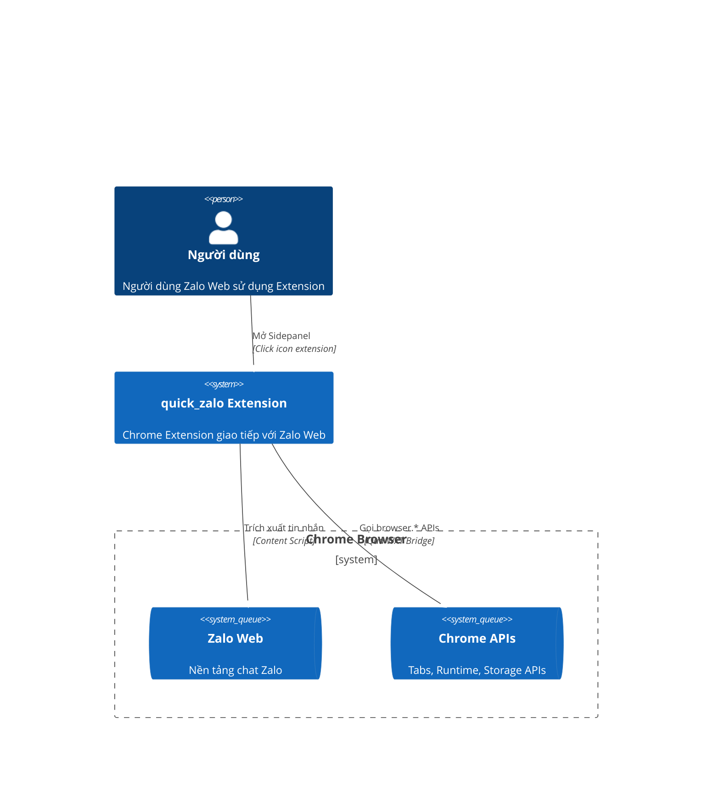
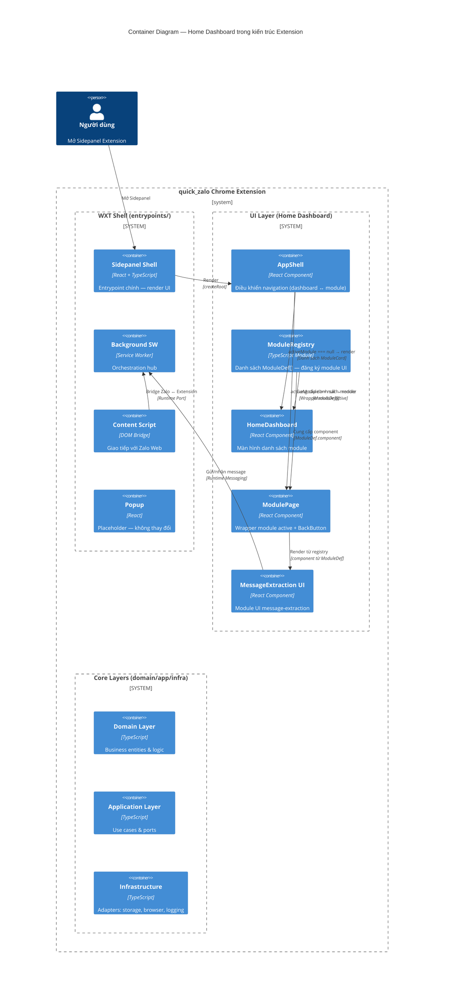
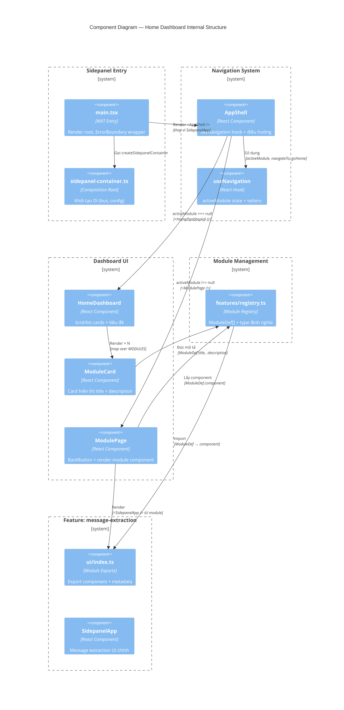
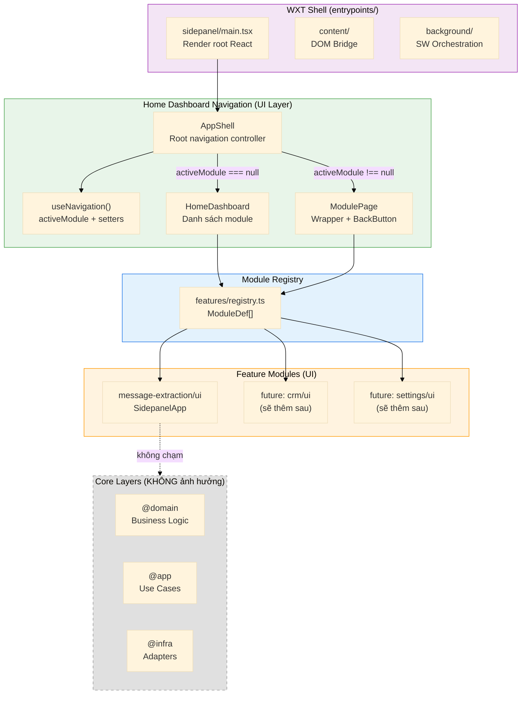

# 1. Tổng quan Kiến trúc (Architecture Overview)

## 1.1 System Context (C4 Level 1)



## 1.2 Container Diagram (C4 Level 2)



## 1.3 Component Diagram (C4 Level 3) — Home Dashboard



## 1.4 Layered Architecture Integration



## 1.5 Dependency Rules

```
AppShell / HomeDashboard / ModulePage / ModuleCard
  │
  ├── đọc: features/registry.ts (ModuleDef[])
  ├── dùng: ui/hooks/use-navigation.ts
  └── render: features/*/ui/ (component)

features/registry.ts
  ├── import: features/message-extraction/ui (ModuleDef[])
  └── export: ModuleDef[], ModuleDef type

features/message-extraction/ui
  ├── export: component (React.FC)
  ├── export: metadata (id, title, description)
  └── NỘI BỘ: dùng domain/app/infra hooks

→ KHÔNG có dependency ngược từ domain/app/infra vào UI layer
```

### Key Design Decisions

| Decision | Lựa chọn | Lý do |
|----------|----------|-------|
| **State management** | `useState` trong `AppShell` | Navigation chỉ 1 cấp (dashboard ↔ module), không cần Context/Redux |
| **Module registry** | Static `ModuleDef[]` array | Module count nhỏ (< 10), không cần dynamic loading |
| **Back navigation** | `activeModule = null` | Đơn giản, không cần history stack |
| **Error boundary** | `ErrorBoundary` bọc `AppShell` | Kế thừa component đã có |
| **Layout** | Full content switching | Không sidebar/tab — module chiếm toàn bộ content area |
