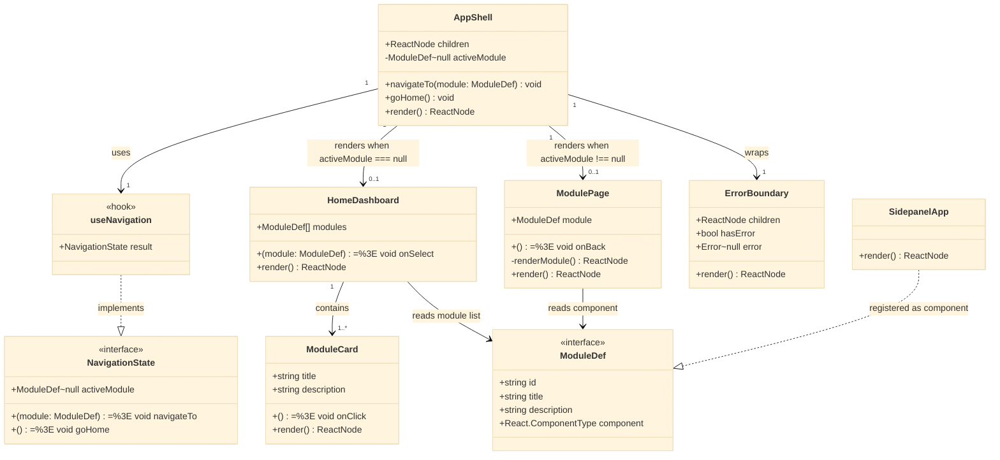
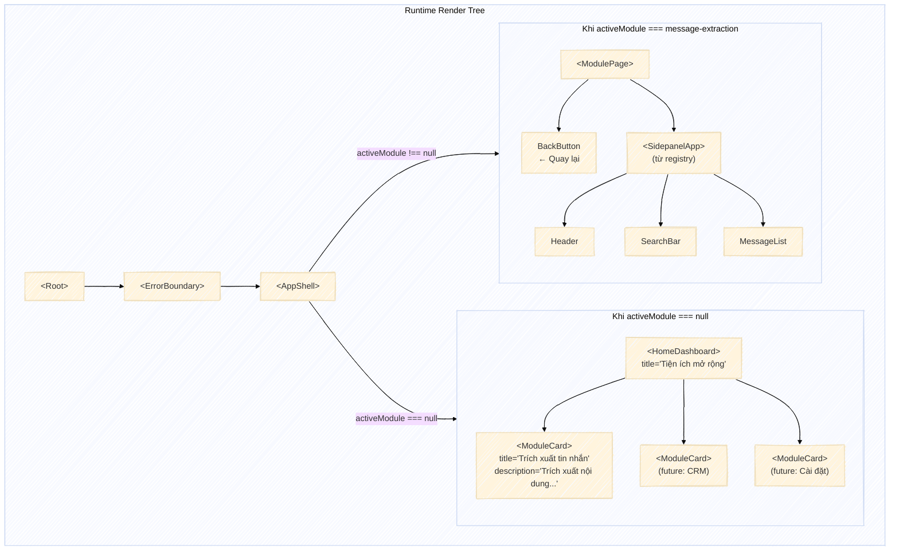
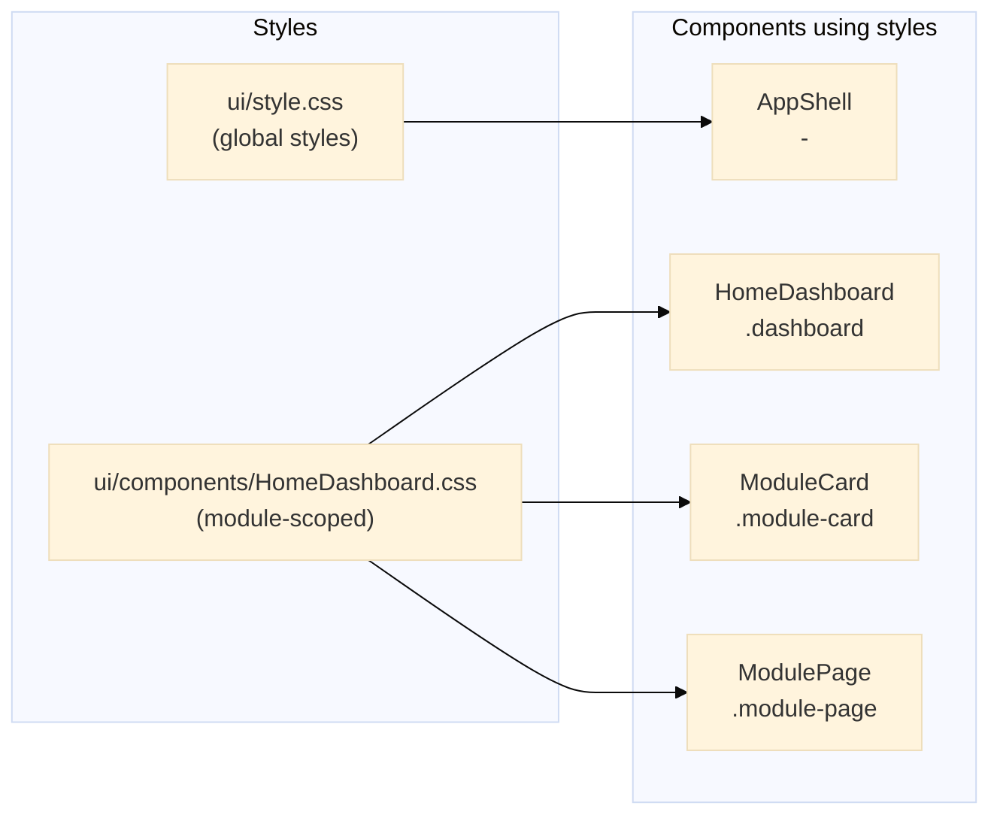
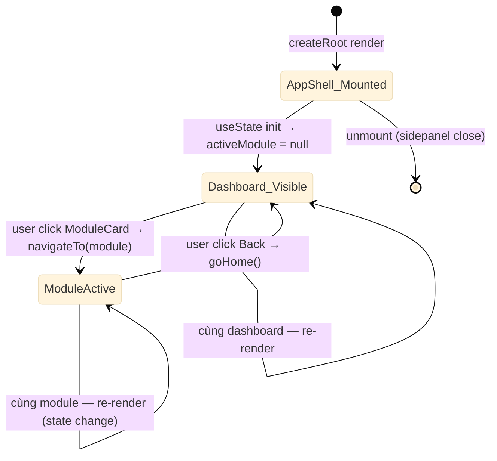

# 2. Hệ thống React Components (Component Hierarchy)

## 2.1 Class Diagram — Component Tree & Contracts



## 2.2 Component Tree Runtime



## 2.3 Props Contract — Chi tiết từng Component

### AppShell

```typescript
// State nội bộ — không props
function AppShell() {
  const { activeModule, navigateTo, goHome } = useNavigation();

  return (
    <ErrorBoundary>
      {activeModule === null ? (
        <HomeDashboard modules={MODULES} onSelect={navigateTo} />
      ) : (
        <ModulePage module={activeModule} onBack={goHome} />
      )}
    </ErrorBoundary>
  );
}
```

### HomeDashboard

```typescript
interface HomeDashboardProps {
  modules: ModuleDef[];       // Danh sách module từ registry
  onSelect: (module: ModuleDef) => void;  // Callback khi click card
}

// Render:
// <div className="dashboard">
//   <h1>Tiện ích mở rộng</h1>
//   <div className="module-grid">
//     {modules.map(m => <ModuleCard key={m.id} ... />)}
//   </div>
// </div>
```

### ModuleCard

```typescript
interface ModuleCardProps {
  title: string;              // Tên hiển thị — VD: "Trích xuất tin nhắn"
  description: string;        // Mô tả ngắn — VD: "Trích xuất nội dung hội thoại..."
  onClick: () => void;        // Handler khi click card
}

// Render:
// <button className="module-card" onClick={onClick}>
//   <h2>{title}</h2>
//   <p>{description}</p>
// </button>
```

### ModulePage

```typescript
interface ModulePageProps {
  module: ModuleDef;          // ModuleDef đang active
  onBack: () => void;         // Handler khi click Back
}

// Render:
// <div className="module-page">
//   <header className="module-page-header">
//     <button className="back-button" onClick={onBack}>
//       ← Quay lại
//     </button>
//     <h2>{module.title}</h2>
//   </header>
//   <div className="module-page-content">
//     <module.component />
//   </div>
// </div>
```

## 2.4 CSS Architecture



**Nguyên tắc styling**:
- Kế thừa `src/ui/style.css` global
- Dashboard-specific styles: file riêng `HomeDashboard.css` hoặc inline styles
- Nhất quán với CSS variables có sẵn
- Không dùng CSS-in-JS library (giữ dependency nhẹ)

## 2.5 Component Lifecycle



### Hook `useNavigation` internal

```typescript
function useNavigation(): NavigationState {
  const [activeModule, setActiveModule] = useState<ModuleDef | null>(null);

  const navigateTo = useCallback((module: ModuleDef) => {
    setActiveModule(module);
  }, []);

  const goHome = useCallback(() => {
    setActiveModule(null);
  }, []);

  return { activeModule, navigateTo, goHome };
}
```

## 2.6 Component Size Estimate

| Component | File | Dòng (est.) | Props |
|-----------|------|-------------|-------|
| `AppShell` | `ui/components/AppShell.tsx` | ~40 | none |
| `HomeDashboard` | `ui/components/HomeDashboard.tsx` | ~60 | `modules, onSelect` |
| `ModuleCard` | `ui/components/ModuleCard.tsx` | ~40 | `title, description, onClick` |
| `ModulePage` | `ui/components/ModulePage.tsx` | ~45 | `module, onBack` |
| `useNavigation` | `ui/hooks/use-navigation.ts` | ~25 | — |
| **Total new** | | **~210** | |
