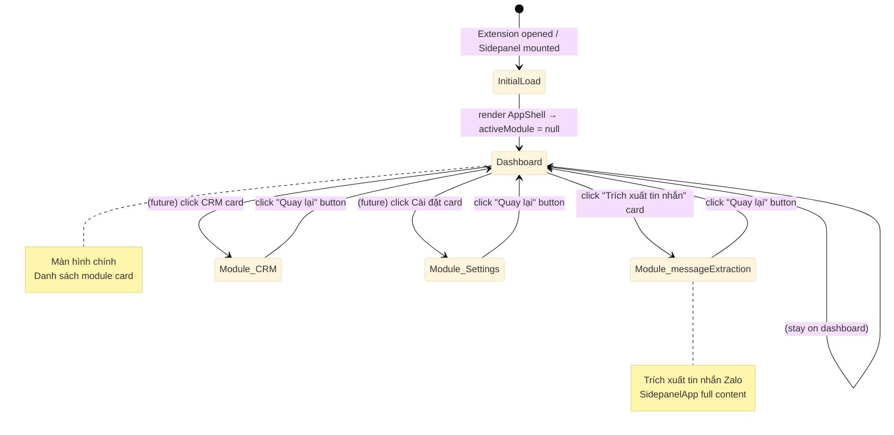
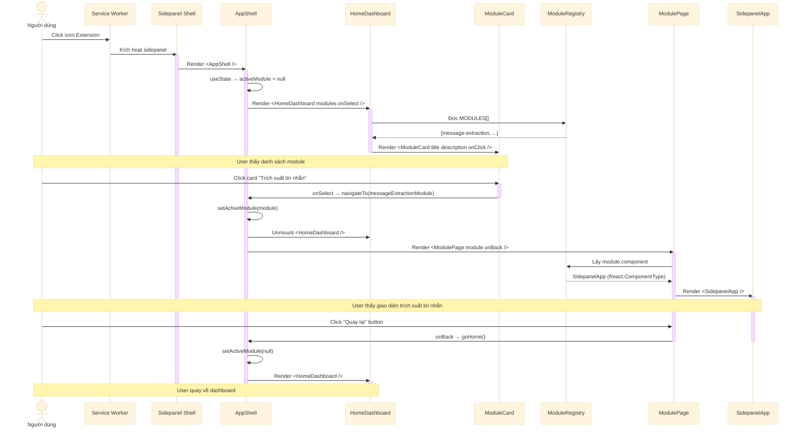
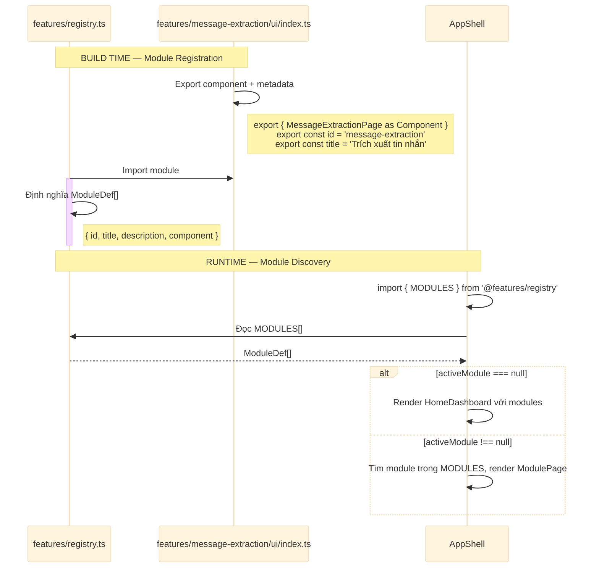
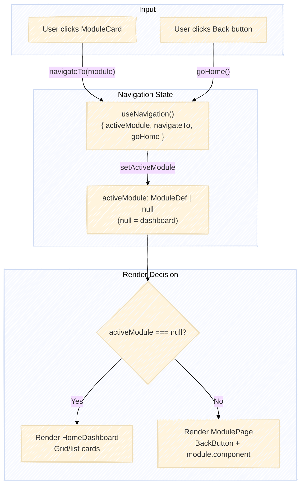
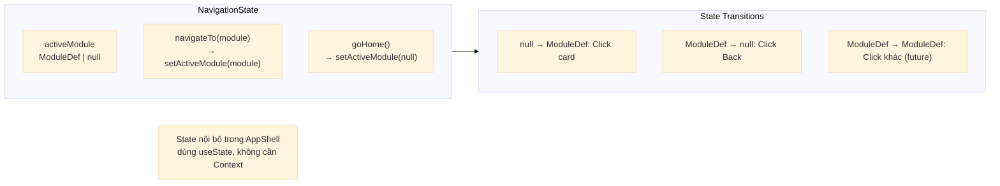
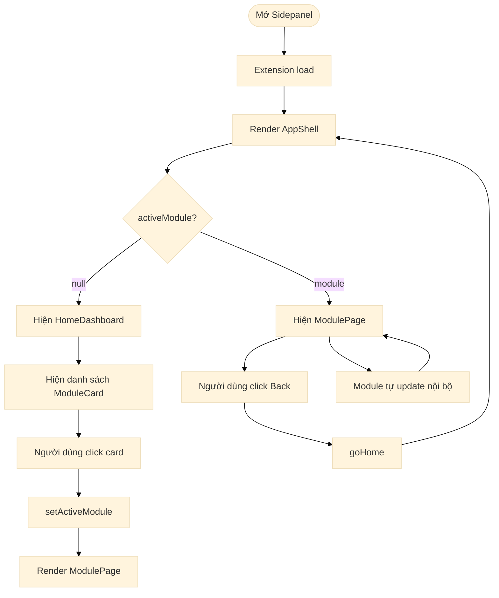
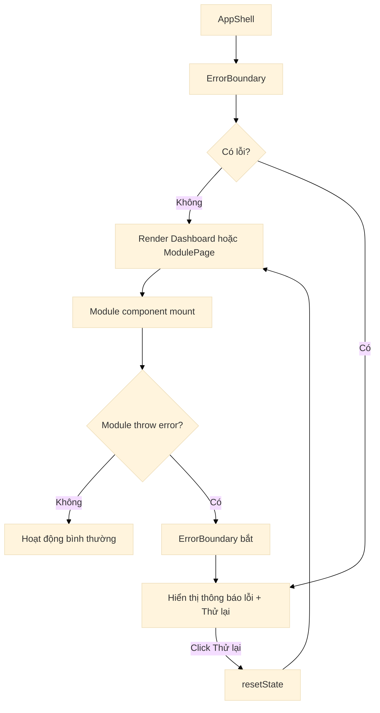

# 3. Luồng Điều hướng (Navigation Flow)

## 3.1 Navigation State Machine

## 3.2 Sequence Diagram — User mở Extension và điều hướng

## 3.3 Sequence Diagram — Module Registration & Discovery

## 3.4 Data Flow Diagram

## 3.5 Navigation State Contract

## 3.6 User Interaction Flow

## 3.7 Error Handling trong Navigation

**Error scenarios**:

| Scenario | Behavior | User thấy gì? |
|----------|----------|--------------|
| Module component crash | `ErrorBoundary` bắt | Banner lỗi + nút "Thử lại" |
| Module không tìm thấy | `ModulePage` check null | "Module không tồn tại" message |
| Back button khi không có module | `goHome` chỉ set null | Dashboard như bình thường |
