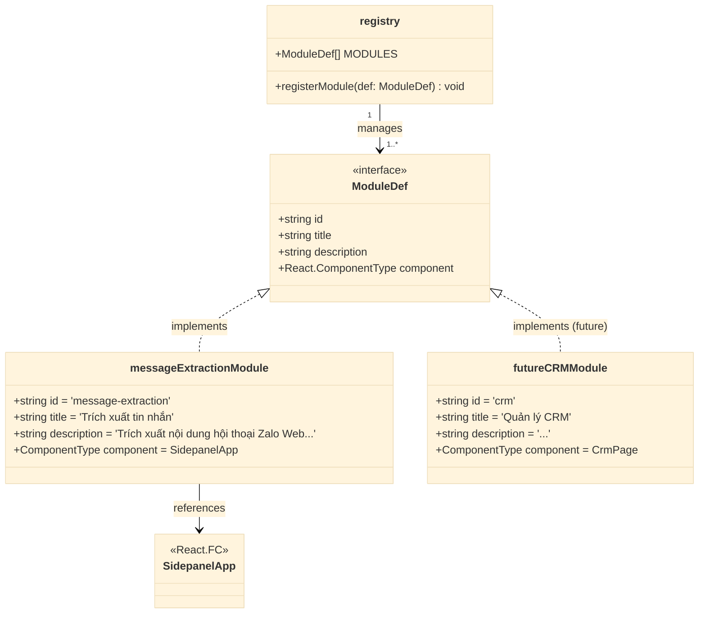
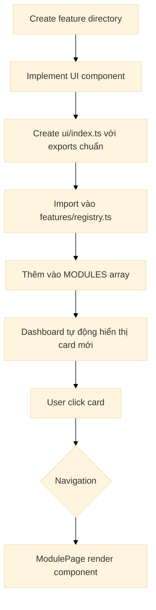
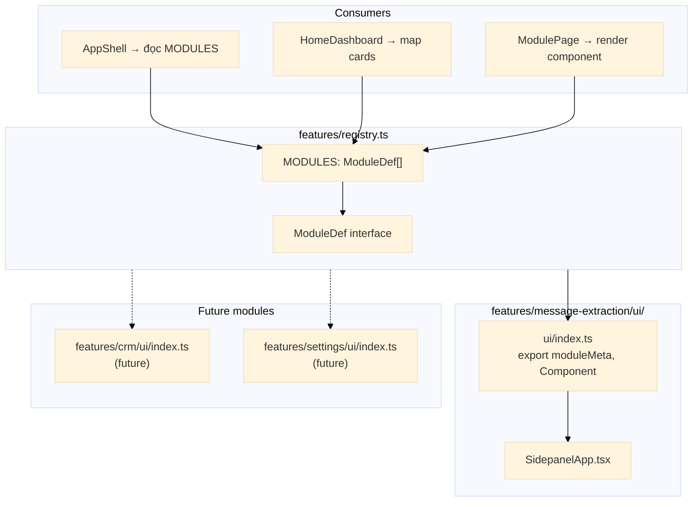
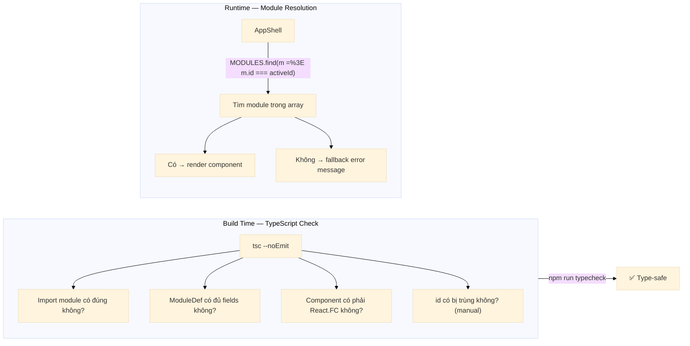

# 4. Module Registry Pattern

## 4.1 ModuleDef Interface

```typescript
// src/features/registry.ts
import type { ComponentType } from 'react';

/**
 * ModuleDef — định nghĩa một feature module UI trong hệ thống Home Dashboard.
 *
 * Mỗi module là 1 bounded context UI, được render toàn màn hình
 * khi người dùng chọn từ HomeDashboard.
 */
export interface ModuleDef {
  /** ID định danh duy nhất — VD: 'message-extraction', 'crm', 'settings' */
  id: string;

  /** Tên hiển thị — VD: 'Trích xuất tin nhắn' */
  title: string;

  /** Mô tả ngắn — VD: 'Trích xuất nội dung hội thoại Zalo và xuất JSON' */
  description: string;

  /** React Component chính — render khi module được chọn */
  component: ComponentType;
}
```

## 4.2 Module Registry — Implementation



## 4.3 Module Export Convention

Mỗi feature module UI **phải** export theo convention sau:

```typescript
// src/features/message-extraction/ui/index.ts
// (file này cần tạo mới)

import { SidepanelApp } from './SidepanelApp';
import type { ModuleDef } from '@features/registry';

/** ID module — khớp với id trong registry */
export const MODULE_ID = 'message-extraction' as const;

/** Metadata cho Home Dashboard */
export const moduleMeta: Pick<ModuleDef, 'id' | 'title' | 'description'> = {
  id: MODULE_ID,
  title: 'Trích xuất tin nhắn',
  description: 'Trích xuất nội dung hội thoại Zalo Web và xuất dữ liệu JSON',
};

/** Component chính để render */
export { SidepanelApp as Component };
// hoặc: export const Component = SidepanelApp;
```

## 4.4 Registry File — Định nghĩa tập trung

```typescript
// src/features/registry.ts

import type { ComponentType } from 'react';

export interface ModuleDef {
  id: string;
  title: string;
  description: string;
  component: ComponentType;
}

// ---------- Import modules ----------
// Mỗi lần thêm module mới, import và thêm vào MODULES array

import { moduleMeta as msgExtMeta, Component as MsgExtComponent } from './message-extraction/ui';

// ---------- Registry ----------

export const MODULES: ModuleDef[] = [
  {
    ...msgExtMeta,
    component: MsgExtComponent,
  },
  // Future modules:
  // { ...crmMeta, component: CrmComponent },
  // { ...settingsMeta, component: SettingsComponent },
];
```

## 4.5 Adding a New Module — Workflow



## 4.6 Module Registry — Dependency Graph



## 4.7 Type Safety



**Lưu ý**: `id` uniqueness cần kiểm tra thủ công hoặc qua test. Không có runtime dedup — mỗi module chịu trách nhiệm có id riêng.

## 4.8 ModuleDef — Quy tắc mở rộng

Khi thêm field mới vào `ModuleDef` (future), cần:

1. Thêm field vào interface `ModuleDef`
2. Update export trong mỗi `features/*/ui/index.ts`
3. Update consumers: `HomeDashboard`, `ModuleCard`
4. Kiểm tra `npm run typecheck` — TypeScript báo lỗi thiếu field ngay

Ví dụ mở rộng (future, không cần ngay):

```typescript
export interface ModuleDef {
  id: string;
  title: string;
  description: string;
  component: ComponentType;
  // Future fields (khi cần):
  // icon?: string;           // Không cần theo scope
  // badge?: number;          // Notification badge
  // disabled?: boolean;      // Disable module tạm thời
  // requiredPermissions?: string[];  // Chrome permissions
}
```
