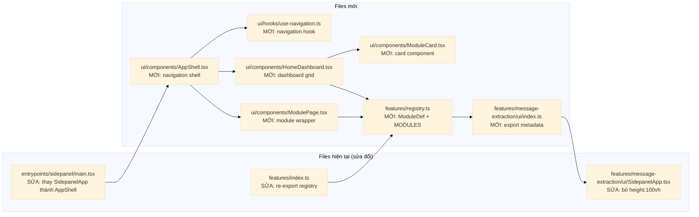
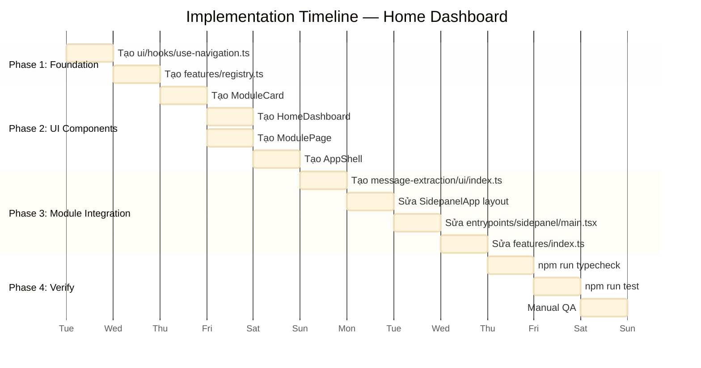
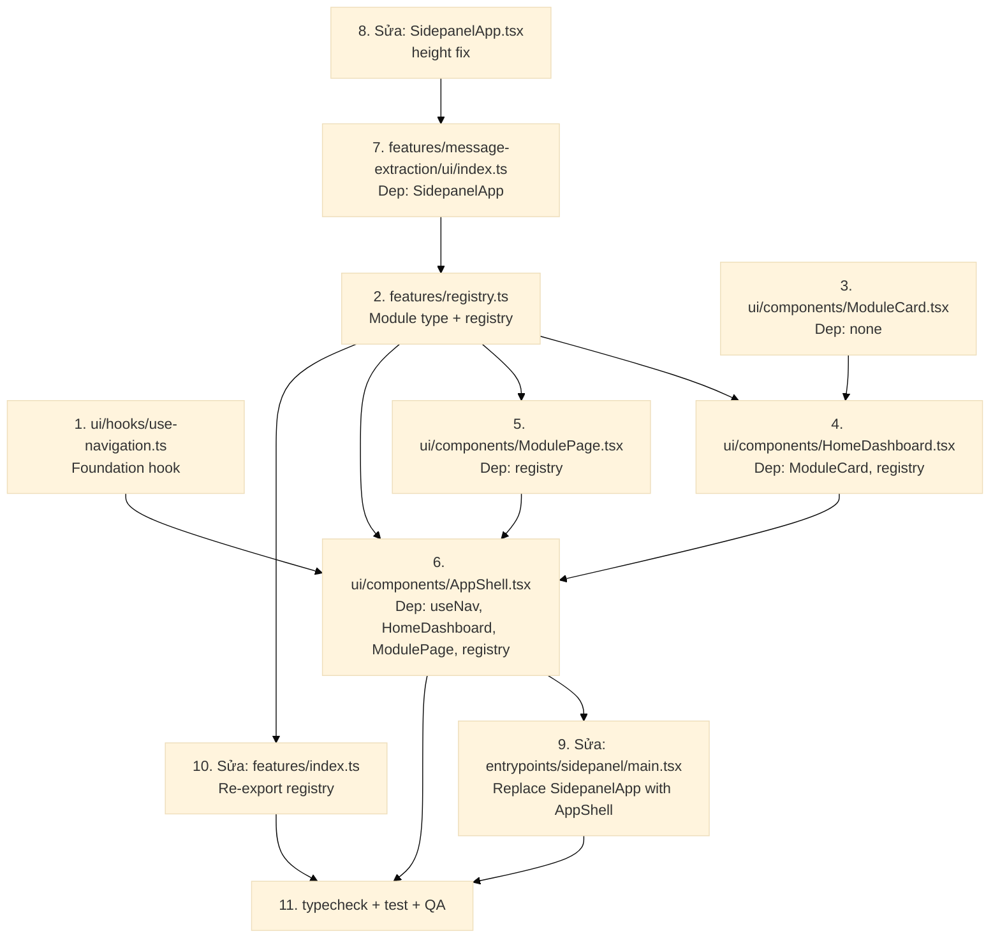

# 5. Kế hoạch Tích hợp vào Codebase

## 5.1 File Change Map



## 5.2 Chi tiết từng file — Before / After

### 5.2.1 `entrypoints/sidepanel/main.tsx` — SỬA

**Before** (current):
```tsx
import { SidepanelApp } from '@features/message-extraction/ui/SidepanelApp';
import { ErrorBoundary } from '@/ui/components/ErrorBoundary';

createRoot(document.getElementById('root')!).render(
  <React.StrictMode>
    <ErrorBoundary>
      <SidepanelApp />
    </ErrorBoundary>
  </React.StrictMode>,
);
```

**After**:
```tsx
import { AppShell } from '@/ui/components/AppShell';
import { ErrorBoundary } from '@/ui/components/ErrorBoundary';

createRoot(document.getElementById('root')!).render(
  <React.StrictMode>
    <ErrorBoundary>
      <AppShell />
    </ErrorBoundary>
  </React.StrictMode>,
);
```

> **Thay đổi**: Import `AppShell` thay vì `SidepanelApp`. `ErrorBoundary` giữ nguyên.

### 5.2.2 `features/registry.ts` — MỚI

```typescript
// src/features/registry.ts
import type { ComponentType } from 'react';

export interface ModuleDef {
  id: string;
  title: string;
  description: string;
  component: ComponentType;
}

// ---------- Module Imports ----------
import { moduleMeta as msgExtMeta, Component as MsgExtComponent } from './message-extraction/ui';

export const MODULES: ModuleDef[] = [
  {
    ...msgExtMeta,
    component: MsgExtComponent,
  },
];
```

### 5.2.3 `features/message-extraction/ui/index.ts` — MỚI

```typescript
// src/features/message-extraction/ui/index.ts
import { SidepanelApp } from './SidepanelApp';

export const MODULE_ID = 'message-extraction' as const;

export const moduleMeta = {
  id: MODULE_ID,
  title: 'Trích xuất tin nhắn',
  description: 'Trích xuất nội dung hội thoại Zalo Web và xuất dữ liệu JSON',
} as const;

export const Component = SidepanelApp;
```

### 5.2.4 `features/message-extraction/ui/SidepanelApp.tsx` — SỬA

**Before**:
```tsx
<div style={{ height: '100vh', ... }}>
```

**After**:
```tsx
<div style={{ height: '100%', minHeight: '100%', ... }}>
```

> **Chỉ thay đổi**: `height: '100vh'` → `height: '100%'` để không bị tràn khi nằm trong ModulePage.

### 5.2.5 `features/index.ts` — SỬA

**Before**:
```typescript
export {};
```

**After**:
```typescript
export { MODULES, type ModuleDef } from './registry';
```

### 5.2.6 `ui/components/AppShell.tsx` — MỚI

```typescript
// src/ui/components/AppShell.tsx
import React from 'react';
import { useNavigation } from '@/ui/hooks/use-navigation';
import { MODULES } from '@features/registry';
import { HomeDashboard } from './HomeDashboard';
import { ModulePage } from './ModulePage';

export const AppShell: React.FC = () => {
  const { activeModule, navigateTo, goHome } = useNavigation();

  return (
    <>
      {activeModule === null ? (
        <HomeDashboard modules={MODULES} onSelect={navigateTo} />
      ) : (
        <ModulePage module={activeModule} onBack={goHome} />
      )}
    </>
  );
};
```

### 5.2.7 `ui/components/HomeDashboard.tsx` — MỚI

```typescript
// src/ui/components/HomeDashboard.tsx
import React from 'react';
import type { ModuleDef } from '@features/registry';
import { ModuleCard } from './ModuleCard';

interface HomeDashboardProps {
  modules: ModuleDef[];
  onSelect: (module: ModuleDef) => void;
}

export const HomeDashboard: React.FC<HomeDashboardProps> = ({ modules, onSelect }) => {
  return (
    <div className="dashboard">
      <h1 className="dashboard-title">Tiện ích mở rộng</h1>
      <div className="module-grid">
        {modules.map((m) => (
          <ModuleCard
            key={m.id}
            title={m.title}
            description={m.description}
            onClick={() => onSelect(m)}
          />
        ))}
      </div>
    </div>
  );
};
```

### 5.2.8 `ui/components/ModuleCard.tsx` — MỚI

```typescript
// src/ui/components/ModuleCard.tsx
import React from 'react';

interface ModuleCardProps {
  title: string;
  description: string;
  onClick: () => void;
}

export const ModuleCard: React.FC<ModuleCardProps> = ({ title, description, onClick }) => {
  return (
    <button className="module-card" onClick={onClick} type="button">
      <h2 className="module-card-title">{title}</h2>
      <p className="module-card-description">{description}</p>
    </button>
  );
};
```

### 5.2.9 `ui/components/ModulePage.tsx` — MỚI

```typescript
// src/ui/components/ModulePage.tsx
import React from 'react';
import type { ModuleDef } from '@features/registry';

interface ModulePageProps {
  module: ModuleDef;
  onBack: () => void;
}

export const ModulePage: React.FC<ModulePageProps> = ({ module: mod, onBack }) => {
  const Component = mod.component;

  return (
    <div className="module-page">
      <header className="module-page-header">
        <button className="back-button" onClick={onBack} type="button">
          ← Quay lại
        </button>
        <h2 className="module-page-title">{mod.title}</h2>
      </header>
      <div className="module-page-content">
        <Component />
      </div>
    </div>
  );
};
```

### 5.2.10 `ui/hooks/use-navigation.ts` — MỚI

```typescript
// src/ui/hooks/use-navigation.ts
import { useState, useCallback } from 'react';
import type { ModuleDef } from '@features/registry';

export interface NavigationState {
  activeModule: ModuleDef | null;
  navigateTo: (module: ModuleDef) => void;
  goHome: () => void;
}

export function useNavigation(): NavigationState {
  const [activeModule, setActiveModule] = useState<ModuleDef | null>(null);

  const navigateTo = useCallback((module: ModuleDef) => {
    setActiveModule(module);
  }, []);

  const goHome = useCallback(() => {
    setActiveModule(null);
  }, []);

  return { activeModule, navigateTo, goHome };
}
```

## 5.3 Implementation Phases



## 5.4 Dependency Graph — File Creation Order



## 5.5 Risk Assessment

| Risk | Likelihood | Impact | Mitigation |
|------|-----------|--------|------------|
| `SidepanelApp` height `100vh` gây scroll double | Cao | Medium | Đổi thành `height: 100%` |
| Module component phụ thuộc `window` height | Thấp | Medium | Test trong ModulePage container |
| Registry import cycle | Thấp | Cao | Giữ registry flat, không circular |
| Missing test coverage | Medium | Low | Co-located test cho navigation hook |
| CSS xung đột với global styles | Medium | Medium | Dùng BEM-style class names |
